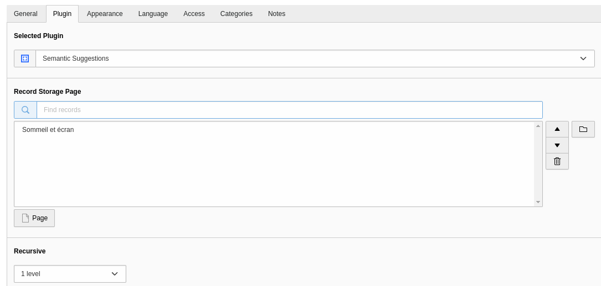

..  include:: /Includes.rst.txt

..  _introduction:

============
Introduction
============

..  _what-it-does:

What does it do?
================

Semantic Suggestion builds a "related pages" list from the text of the pages
themselves. No category has to be maintained and no link has to be created by hand.

*   A scheduler task walks a page tree, turns every page into a TF-IDF vector and
    compares the vectors pairwise.
*   Every pair scoring above a configurable threshold is written to the table
    :sql:`tx_semanticsuggestion_similarities`.
*   A frontend plugin reads that table for the page being rendered and displays the
    best matches with their title, media and a text excerpt.
*   A backend module (:guilabel:`Web > Semantic Suggestion`) shows what was stored.

Because the frontend only reads pre-computed rows, displaying suggestions costs a
single indexed query — all the work happens in the scheduler task.

    The plugin output with the shipped template.

..  _what-it-does-not-do:

What it does not do
===================

*   It does not index anything on the fly. A page that was created after the last
    task run has no suggestions until the task runs again.
*   It does not compare pages across sites, nor across languages. Both boundaries
    are enforced (see :ref:`multisite`).
*   It does not need Solr. A separate extension, ``semantic_suggestion_solr``, can
    write into the same table from a Solr index; the two producers coexist without
    erasing each other's rows.

..  _performance:

Performance
===========

..  list-table::
    :header-rows: 1

    *   -   Where
        -   Cost
    *   -   Scheduler task
        -   The dominant cost, quadratic in the number of pages of the scope. Expect
            seconds on a small tree, minutes from a few hundred pages, and schedule
            it off-peak.
    *   -   Frontend
        -   One indexed :sql:`SELECT` on
            :sql:`(page_id, root_page_id, sys_language_uid)`, plus one page record
            and one media lookup per displayed suggestion.
    *   -   Backend module
        -   Reads every row of the selected site to compute its statistics.

The measured task duration depends far more on the average amount of text per page
than on the page count alone. Use the :ref:`backend module <backend-module>` to see
how many pairs a given quality level actually produces before lowering it.

..  _credits:

Credits
=======

The text processing — language detection, stop words, stemming and TF-IDF
vectorisation — is provided by the
`nlp_tools <https://github.com/cywolf/nlp_tools>`__ extension, which in turn uses
`wamania/php-stemmer <https://github.com/wamania/php-stemmer>`__ (Snowball).
