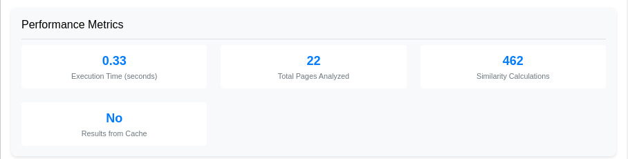

# TYPO3 Extension: Semantic Suggestion

[](https://get.typo3.org/version/12)
[](https://get.typo3.org/version/13)
[](https://packagist.org/packages/talan-hdf/semantic-suggestion)
[](https://packagist.org/packages/talan-hdf/semantic-suggestion)

This extension provides a plugin for TYPO3 v12 that suggests semantically related pages. Semantic suggestion enhances user experience by automatically recommending relevant content, increasing engagement and time spent on your website.

## Introduction

Semantic Suggestion analyzes the content of your pages and creates intelligent connections between them. By understanding the context and meaning of your content, it offers visitors related pages that are truly relevant to their interests, improving navigation and content discovery.


### Frontend View


## Requirements

- TYPO3 12.0.0-13.9.99
- PHP 8.0 or higher

## Features

- Analyzes subpages of a specified parent page
- Displays title, associated media, and enhanced text excerpt of suggested pages
- Configurable via TypoScript
- Allows setting the parent page ID, proximity threshold, and search depth
- Optimized performance by storing proximity scores in the database and updating them periodically
- Built-in multilingual support
- Improved compatibility with various TYPO3 content structures, including Bootstrap Package
- Option to exclude specific pages from analysis and suggestions

## Installation

### Composer Installation (recommended)

1. Install the extension via composer:
   ```
   composer require talan-hdf/semantic-suggestion
   ```

2. Activate the extension in the TYPO3 Extension Manager

### Manual Installation

1. Download the extension from the [TYPO3 Extension Repository (TER)](https://extensions.typo3.org/) or the GitHub repository.
2. Upload the extension file to your TYPO3 installation's `typo3conf/ext/` directory.
3. In the TYPO3 backend, go to the Extension Manager and activate the "Semantic Suggestion" extension.


## Configuration

Edit your TypoScript setup and adjust the following parameters:

```typoscript
plugin.tx_semanticsuggestion {
    settings {
        parentPageId = 1
        proximityThreshold = 0.7
        maxSuggestions = 3
        excerptLength = 150
        recursive = 1
        excludePages = 8,9,3456
        analyzedFields {
            title = 1.5
            description = 1.0
            keywords = 2.0
            abstract = 1.2
            content = 1.0
        }
    }
}
```

### Weight System for Analyzed Fields

The `analyzedFields` section allows you to configure the importance of different content fields in the similarity calculation. Here's how the weight system works:

- Weights can be any positive number.
- A weight of 1.0 is considered standard importance.
- Weights greater than 1.0 increase a field's importance.
- Weights less than 1.0 decrease a field's importance.
- There is no strict maximum; you can use values like 3.0 or higher for fields you consider extremely important.

Example weight ranges:
- 0.5: Half as important as standard
- 1.0: Standard importance
- 1.5: 50% more important than standard
- 2.0: Twice as important as standard
- 3.0 and above: Significantly more important than standard

Adjust these weights based on your specific content structure and similarity requirements. For example, if titles are crucial for determining similarity in your case, you might increase the title weight to 2.0 or higher.

### Configuration Parameters

- `parentPageId`: The ID of the parent page from which the analysis starts
- `proximityThreshold`: The minimum similarity threshold for displaying a suggestion (0.0 to 1.0)
- `maxSuggestions`: The maximum number of suggestions to display
- `excerptLength`: The maximum length of the text excerpt for each suggestion
- `recursive`: The search depth in the page tree (0 = only direct children)
- `excludePages`: Comma-separated list of page UIDs to exclude from analysis and suggestions


## Usage

Insert the plugin "Semantic Suggestions" on the desired page using the TYPO3 backend.

To add the plugin directly in your Fluid template, use:

```html
<f:cObject typescriptObjectPath="tt_content.list.20.semanticsuggestion_suggestions" />
```

Or use the defined library:

```html
<f:cObject typescriptObjectPath="lib.semantic_suggestion" />
```

## Similarity Logic

The extension uses a custom similarity calculation to determine related pages. Here is an overview of the logic:

1. **Data Gathering**: For each subpage of the specified parent page, the extension gathers the title, description, keywords, and content.
2. **Similarity Calculation**: The extension compares each pair of pages by calculating a similarity score based on the intersection and union of their words. The similarity score is the ratio of the number of common words to the total number of unique words, weighted by the importance of each field.
3. **Proximity Threshold**: Only pages with a similarity score above the configured threshold are considered related and displayed.
4. **Caching Scores**: To optimize performance, the calculated scores are stored in a database table `tx_semanticsuggestion_scores`. These scores are periodically updated or when the page content changes.


## Backend Module


The Semantic Suggestion extension now includes a powerful backend module that provides comprehensive insights into the semantic relationships between your pages. This module offers the following features:

- **Similarity Analysis**: Visualize the semantic similarity between pages in your TYPO3 installation.
- **Top Similar Pairs**: Quickly identify the most semantically related page pairs.
- **Distribution of Similarity Scores**: Get a clear overview of how similarity is distributed across your content.
- **Configurable Analysis**: Set custom parameters such as parent page ID, analysis depth, and similarity thresholds.
- **Visual Representation**: Utilize progress bars and charts for an intuitive understanding of the data.
- **Detailed Statistics**: View in-depth statistics about page similarities and content relationships.

To access the module, navigate to the backend and look for "Semantic Suggestion" under the Web menu. This tool is invaluable for content managers and editors looking to optimize content structure, improve internal linking, and understand the thematic relationships within their website.

Note: The effectiveness of the semantic analysis depends on the quality and quantity of your content. For best results, ensure your pages have meaningful titles, descriptions, and content.

##  Backend Module - Performance Metrics

The Semantic Suggestion extension provides,  through the backend module, performance metrics to help you understand and optimize its operation. Here's an explanation of each metric:



### Execution Time (seconds)

**Calculation:** This is the total time taken to perform the semantic analysis, including page retrieval, similarity calculations, and caching operations.

**Interpretation:** 
- A lower value indicates faster execution.
- If consistently high, consider optimizing your content structure or increasing the caching duration.
- Note: When results are from cache, this value may appear as 0.00 seconds.

### Total Pages Analyzed

**Calculation:** The total number of pages included in the semantic analysis.

**Interpretation:**
- This number depends on your page tree structure and the configured depth of analysis.
- A higher number may lead to more accurate suggestions but can increase execution time.

### Similarity Calculations

**Calculation:** The total number of page-to-page similarity comparisons performed.

**Interpretation:**
- This is typically calculated as `n * (n-1) / 2`, where `n` is the number of pages analyzed.
- A higher number indicates more comprehensive analysis but may impact performance.

### Results from Cache

**Calculation:** A boolean indicator (Yes/No) showing whether the results were retrieved from cache.

**Interpretation:**
- "Yes" indicates that the results were retrieved from cache, resulting in faster execution.
- "No" means a fresh analysis was performed.
- Frequent "No" results might indicate that your cache is being cleared too often or that your content is changing frequently.

### Optimizing Performance

1. **Caching:** Ensure your caching configuration is appropriate for your update frequency.
2. **Analysis Depth:** Adjust the analysis depth to balance between comprehensive results and performance.
3. **Excluded Pages:** Use the `excludePages` setting to omit irrelevant pages from analysis.
4. **Content Structure:** Organize your content to minimize the number of pages that need to be analyzed without compromising suggestion quality.

By monitoring these metrics, you can fine-tune the extension's configuration to achieve the best balance between performance and suggestion accuracy for your specific use case.


## Display Customization

The Fluid template (List.html) can be customized to adapt the display of suggestions to your needs. You can override this template by configuring your own template paths in TypoScript.

## Multilingual Support

The extension supports TYPO3's multilingual structure. It analyzes and suggests pages in the current site language.

## Debugging and Maintenance

The extension uses TYPO3's logging system. You can configure logging to get more information about the analysis and suggestion process.

## Security

- Protection against SQL injections through the use of TYPO3's secure query mechanisms (QueryBuilder)
- Protection against XSS attacks thanks to automatic output escaping in Fluid templates
- Access control restricted to users with appropriate permissions

## Performance

- Storage of similarity scores in the database to avoid repeated calculations
- Periodic update of scores or when page content changes
- Optimized content retrieval process for improved performance with large numbers of pages
- Efficient handling of excluded pages to reduce unnecessary calculations
- Improved caching mechanisms for faster retrieval of analysis results
- Batch processing of page analysis to manage server load effectively

## File Structure and Logic

```
ext_semantic_suggestions/
├── Classes/
│   ├── Controller/
│   │   └── SuggestionsController.php
│   └── Service/
│       └── PageAnalysisService.php
│       └── Hooks/
│           └── DataHandlerHook.php
├── Configuration/
│   └── TypoScript/
│       └── setup.typoscript
├── Resources/
│   ├── Private/
│   │   ├── Language/
│   │   │   └── locallang.xlf
│   │   └── Templates/
│   │       └── Suggestions/
│   │           └── List.html
│   └── Public/
│       └── Icons/
│           └── Extension.svg
├── ext_emconf.php
├── ext_localconf.php
└── ext_tables.php
```

## Contributing

Contributions to the Semantic Suggestion extension are welcome! Here's how you can contribute:

1. Fork the repository
2. Create a new branch for your feature or bug fix
3. Make your changes and commit them with a clear commit message
4. Push your changes to your fork
5. Submit a pull request to the main repository

Please make sure to follow the existing coding standards and include appropriate tests for your changes.

## License

This project is licensed under the GNU General Public License v2.0 or later. See the [LICENSE](LICENSE) file for more details.

## Support

For support and further information, please contact:

Wolfangel Cyril  
Email: cyril.wolfangel@gmail.com

For bug reports and feature requests, please use the [GitHub issue tracker](https://github.com/your-username/semantic-suggestion/issues).

For additional documentation and updates, visit our [GitHub repository](https://github.com/your-username/semantic-suggestion).