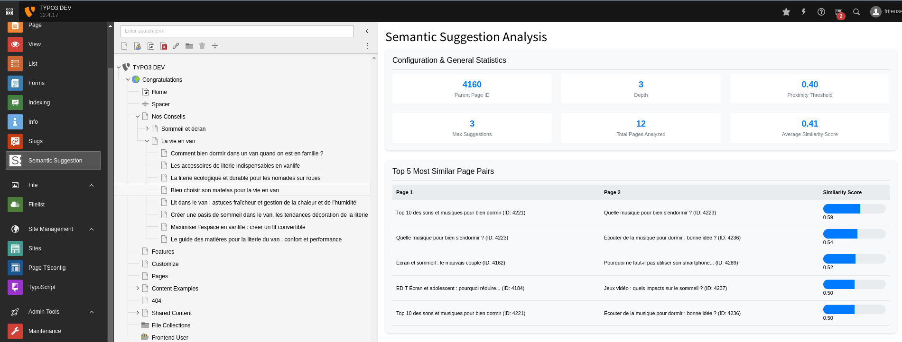
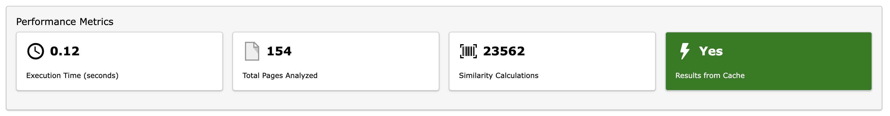
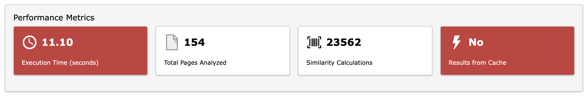

# 🧠 TYPO3 Extension: Semantic Suggestion

## Join Our Community on Slack

We have a dedicated Slack channel where you can ask questions, discuss new features, and provide feedback on the extension. Join us to stay updated and participate in the conversation!

[Join the Slack Channel](https://typo3.slack.com/archives/C07HFM4364Q)

We look forward to seeing you there and engaging with you!


[](https://get.typo3.org/version/12)
[](https://get.typo3.org/version/13)
[](https://packagist.org/packages/talan-hdf/semantic-suggestion)
[](https://packagist.org/packages/talan-hdf/semantic-suggestion)

> Elevate your TYPO3 website with intelligent, content-driven recommendations

## 🌟 Introduction

The Semantic Suggestion extension revolutionizes the way related content is presented on TYPO3 websites. Moving beyond traditional "more like this" functionalities based on categories and taxonomies, this extension employs advanced semantic analysis to create genuinely relevant content connections.

### Key Benefits:

- 🎯 **Highly Relevant Links**: Automatically generate connections based on actual content similarity, not just predefined categories.
- ⏱️ **Increased User Engagement**: Keep visitors on your site longer by offering truly related content.
- 🕸️ **Semantic Cocoon**: Contribute to a high-quality semantic network within your website, enhancing SEO and user navigation.
- 🤖 **Intelligent Automation**: Reduce manual linking work while improving internal link quality.

### Performance Consideration

While the Semantic Suggestion extension offers powerful capabilities, it's important to note:

- 📊 The similarity calculation process scales exponentially with the number of pages.
- ⏳ For sites with over 500 pages, the initial calculation may take up to 30 seconds, depending on server capacity.
- 💡 We recommend using the backend module to assess the caching time for your specific setup.
- 🔄 The cache is automatically reset when a page or content is modified, ensuring up-to-date similarity calculations.

> 📌 **Pro Tip**: Utilize the backend module to monitor performance and optimize settings for your specific use case.

By leveraging the power of semantic analysis, this extension provides a superior alternative to traditional related content plugins, offering more accurate and valuable content suggestions to your users.

---

## 📚 Table of Contents

- [Introduction](#-introduction)
- [Features](#-features)
- [Requirements](#-requirements)
- [Installation](#-installation)
- [Configuration](#-configuration)
- [Usage](#-usage)
- [Backend Module](#-backend-module)
- [Similarity Logic](#-similarity-logic)
- [Display Customization](#-display-customization)
- [Multilingual Support](#-multilingual-support)
- [Debugging and Maintenance](#-debugging-and-maintenance)
- [Security](#-security)
- [Performance](#-performance)
- [File Structure](#-file-structure)
- [Unit Tests](#-unit-tests)
- [Contributing](#-contributing)
- [License](#-license)
- [Support](#-support)


### Frontend View


## 🚀 Features

- 🔍 Analyzes subpages of a specified parent page
- 📊 Displays title, associated media, and enhanced text excerpt of suggested pages
- ⚙️ Highly configurable via TypoScript
- 🎛 Customizable parent page ID, proximity threshold, and search depth
- 💾 Optimized performance with database caching of proximity scores
- 🌐 Built-in multilingual support
- 🧩 Improved compatibility with various TYPO3 content structures, including Bootstrap Package
- 🚫 Option to exclude specific pages from analysis and suggestions

## 🛠 Requirements

- TYPO3 12.0.0-13.9.99
- PHP 8.0 or higher

## 💻 Installation

<details>
<summary><strong>Composer Installation (recommended)</strong></summary>

1. Install the extension via composer:
   ```bash
   composer require talan-hdf/semantic-suggestion
   ```

2. Activate the extension in the TYPO3 Extension Manager
</details>

<details>
<summary><strong>Manual Installation</strong></summary>

1. Download the extension from the [TYPO3 Extension Repository (TER)](https://extensions.typo3.org/extension/semantic_suggestion) or the GitHub repository.
2. Upload the extension file to your TYPO3 installation's `typo3conf/ext/` directory.
3. In the TYPO3 backend, go to the Extension Manager and activate the "Semantic Suggestion" extension.
</details>

## ⚙️ Configuration

Edit your TypoScript setup to configure the extension:

```typoscript
plugin.tx_semanticsuggestion {
    settings {
        parentPageId = 1
        proximityThreshold = 0.7
        maxSuggestions = 3
        excerptLength = 150
        recursive = 1
        excludePages = 8,9,3456
        recencyWeight = 0.2

        analyzedFields {
            title = 1.5
            description = 1.0
            keywords = 2.0
            abstract = 1.2
            content = 1.0
        }
    }
}
```

### Weight System for Analyzed Fields

The `analyzedFields` section allows you to configure the importance of different content fields in the similarity calculation:

| Weight | Importance |
|--------|------------|
| 0.5    | Half as important as standard |
| 1.0    | Standard importance |
| 1.5    | 50% more important than standard |
| 2.0    | Twice as important as standard |
| 3.0+   | Significantly more important than standard |

<details>
<summary><strong>Configuration Parameters Explained</strong></summary>

- `parentPageId`: The ID of the parent page from which the analysis starts
- `proximityThreshold`: The minimum similarity threshold for displaying a suggestion (0.0 to 1.0)
- `maxSuggestions`: The maximum number of suggestions to display
- `excerptLength`: The maximum length of the text excerpt for each suggestion
- `recursive`: The search depth in the page tree (0 = only direct children)
- `excludePages`: Comma-separated list of page UIDs to exclude from analysis and suggestions
- `recencyWeight`: Weight of recency in similarity calculation (0-1) 
- `recencyWindow`: Number of days to consider for recency calculations (default: 30)
- `minRecencyDifference`: Minimum difference in days to apply recency boost (default: 1)
- `recencyDecayFactor`: Factor for logarithmic decay of recency importance (0.1 to 1.0, default: 0.5)

</details>

### The Weight of Recency in Similarity Calculation (0-1)

The `recencyWeight` parameter determines the importance of publication or modification date in similarity calculations:

- **0:** Recency has no impact
- **1:** Recency has maximum impact

<details>
<summary><strong>How Recency Weight Works</strong></summary>

1. Base similarity score is calculated from content
2. Recency boost is calculated based on publication/modification dates
3. Final similarity is a weighted combination of content similarity and recency boost

Formula:
```
finalSimilarity = (contentSimilarity * (1 - recencyWeight)) + (recencyBoost * recencyWeight)
```

Choosing the right value:
- Low (0.1-0.3): Slightly favor recent content
- Medium (0.4-0.6): Balance between content similarity and recency
- High (0.7-0.9): Strongly favor recent content

Consider your specific use case:
- News website: Higher recency weight
- Educational resource: Lower recency weight
- General blog: Medium recency weight
</details>


#### New Configuration Parameters

- `recencyWindow`: Number of days to consider for recency calculations (default: 30)
- `minRecencyDifference`: Minimum difference in days to apply recency boost (default: 1)
- `recencyDecayFactor`: Factor for logarithmic decay of recency importance (0.1 to 1.0, default: 0.5)

#### How the Advanced Recency Boost Works

1. **Time Window**: Only considers content changes within the specified `recencyWindow` (e.g., last 30 days).
2. **Minimum Difference**: Ignores tiny time differences less than `minRecencyDifference` to avoid insignificant boosts.
3. **Normalization**: Converts actual ages to a 0-1 scale within the recency window.
4. **Logarithmic Decay**: Applies a logarithmic function to give more weight to recent changes while reducing the impact of older ones.
5. **Configurable Decay**: Uses `recencyDecayFactor` to adjust the steepness of the decay curve.

#### Recency Boost Calculation Process

1. Calculate the age of each page in seconds.
2. If the age difference is less than `minRecencyDifference`, return 0 (no boost).
3. Normalize ages to 0-1 scale based on `recencyWindow`.
4. Apply logarithmic decay: `1 - (log(1 + normalizedAge * 9) / log(10)) * decayFactor`
5. Calculate the absolute difference between the decayed values of the two pages.

#### Formula

```
recencyBoost = abs((1 - (log(1 + normalizedAge1 * 9) / log(10)) * decayFactor) - 
                   (1 - (log(1 + normalizedAge2 * 9) / log(10)) * decayFactor))
```

Where:
- `normalizedAge` is the page age divided by `recencyWindow`, capped at 1
- `decayFactor` is the configured `recencyDecayFactor`

#### Advantages of this Approach

- **Meaningful Differences**: Ignores insignificant time differences.
- **Balanced Importance**: Gives more weight to recent content without overshadowing relevance.
- **Customizable**: Allows fine-tuning for different types of websites and content strategies.
- **Gradual Decay**: Provides a smooth transition in importance as content ages.

#### Configuring for Your Needs

- **News Site**: Use a shorter `recencyWindow` (e.g., 7 days) and higher `recencyDecayFactor` (e.g., 0.8)
- **Evergreen Content**: Use a longer `recencyWindow` (e.g., 90 days) and lower `recencyDecayFactor` (e.g., 0.3)
- **Balanced Approach**: Keep default values or slightly adjust based on content update frequency

By leveraging this advanced recency boost calculation, the Semantic Suggestion extension provides a nuanced and configurable way to balance content relevance with recency, suitable for a wide range of website types and content strategies.


## 🖥 Usage


### In Fluid Templates

To add the plugin directly in your Fluid template, use:

```html
<f:cObject typoscriptObjectPath='lib.semantic_suggestion' />
```

This method uses the TypoScript configuration and is suitable for simple integrations.

### TypoScript Integration

You can also integrate the Semantic Suggestions plugin using TypoScript. Add the following TypoScript setup to your configuration:

```typoscript
lib.semantic_suggestion = USER
lib.semantic_suggestion {
    userFunc = TYPO3\CMS\Extbase\Core\Bootstrap->run
    extensionName = SemanticSuggestion
    pluginName = Suggestions
    vendorName = TalanHdf
    controller = Suggestions
    action = list
}
```

Then, you can use it in your TypoScript template like this:

```typoscript
page.10 = < lib.semantic_suggestion
```

Or in specific content elements:

```typoscript
tt_content.semantic_suggestion = COA
tt_content.semantic_suggestion {
    10 = < lib.semantic_suggestion
}
```

Remember to include your TypoScript template in your site configuration or page setup.

## 🎛 Backend Module



The Semantic Suggestion extension includes a powerful backend module providing comprehensive insights into semantic relationships between your pages.

### Features

- 📊 **Similarity Analysis**: Visualize semantic similarity between pages
- 🔝 **Top Similar Pairs**: Quickly identify most related page pairs
- 📈 **Distribution of Similarity Scores**: Overview of similarity across content
- ⚙️ **Configurable Analysis**: Set custom parameters (parent page ID, depth, thresholds)
- 📊 **Visual Representation**: Intuitive charts and progress bars
- 📑 **Detailed Statistics**: In-depth page similarity and content relationship data

Access the module under the "Web" menu in the TYPO3 backend.

> 💡 **Tip**: The effectiveness of semantic analysis depends on content quality and quantity. Ensure your pages have meaningful titles, descriptions, and content for best results.

### Performance Metrics




The backend module provides crucial performance metrics to help optimize the extension's operation:

<details>
<summary><strong>Execution Time (seconds)</strong></summary>

- **What**: Total time for semantic analysis, including page retrieval, calculations, and caching
- **Interpretation**: 
  - Lower is better
  - High values may indicate need for content structure optimization or increased caching
  - 0.00 seconds typically means results were cached
</details>

<details>
<summary><strong>Total Pages Analyzed</strong></summary>

- **What**: Number of pages included in the semantic analysis
- **Interpretation**: 
  - Depends on page tree structure and configured analysis depth
  - Higher numbers may increase accuracy but also execution time
</details>

<details>
<summary><strong>Similarity Calculations</strong></summary>

- **What**: Total number of page-to-page similarity comparisons
- **Calculation**: Typically `n * (n-1) / 2`, where `n` is the number of pages analyzed
- **Interpretation**: 
  - Higher numbers indicate more comprehensive analysis
  - May impact performance with large page sets
</details>

<details>
<summary><strong>Results from Cache</strong></summary>

- **What**: Indicates whether results were retrieved from cache (Yes/No)
- **Interpretation**: 
  - "Yes" means faster execution (cached results)
  - "No" indicates a fresh analysis was performed
  - Frequent "No" results might suggest too frequent cache clearing or rapidly changing content
</details>

#### Optimizing Performance

1. **Caching**: Adjust caching configuration to match your update frequency
2. **Analysis Depth**: Balance comprehensiveness with performance
3. **Excluded Pages**: Use `excludePages` setting to omit irrelevant pages
4. **Content Structure**: Organize content to minimize analyzed pages without compromising quality

Monitor these metrics to fine-tune the extension's configuration for your specific use case.

## 🧮 Similarity Logic

The extension employs a custom similarity calculation to determine related pages:

1. **Data Gathering**: Collects title, description, keywords, and content for each subpage of the specified parent page.
2. **Similarity Calculation**: Compares page pairs using a word intersection and union method. The similarity score is the ratio of common words to total unique words, weighted by field importance.
3. **Proximity Threshold**: Only pages with similarity scores above the configured threshold are considered related and displayed.
4. **Caching Scores**: Calculated scores are stored in `tx_semanticsuggestion_scores` table for performance optimization. These are updated periodically or when page content changes.

## 🎨 Display Customization

Customize the display of suggestions by overriding the Fluid template (List.html). Configure your own template paths in TypoScript:

```typoscript
plugin.tx_semanticsuggestion {
    view {
        templateRootPaths.10 = EXT:your_extension/Resources/Private/Templates/
    }
}
```
## Enhanced Semantic Analysis

Our latest update introduces several improvements to the semantic analysis process:

1. **Multi-lingual Support**: The system now handles stop words for multiple languages, improving the accuracy of analysis across different content languages.

2. **N-gram Analysis**: In addition to individual word analysis, we now use n-grams to capture phrases and improve context understanding.

3. **TF-IDF Scoring**: Term Frequency-Inverse Document Frequency (TF-IDF) has been implemented to better identify important terms within the context of your entire site.

4. **Recency Boost**: A configurable recency boost factor allows newer content to be given more weight in similarity calculations.

5. **Text Normalization**: Advanced text normalization techniques have been applied to improve comparison accuracy across different text formats and encodings.

6. **Levenshtein Distance**: Similar word detection using Levenshtein distance helps in identifying related content even with minor spelling variations.

These enhancements provide a more nuanced and accurate similarity analysis, leading to better content suggestions and improved semantic relationships between pages.


## 🌐 Multilingual Support

The extension fully supports TYPO3's multilingual structure, analyzing and suggesting pages in the current site language.

## 🐛 Debugging and Maintenance

The Semantic Suggestion extension utilizes TYPO3's logging system for comprehensive debugging and maintenance:

- 📝 Configure logging to get detailed information about the analysis and suggestion process
- 🔍 Monitor extension behavior and performance
- 🚀 Optimize based on logged data

<details>
<summary><strong>Configuring Logging</strong></summary>

Add the following to your `typo3conf/AdditionalConfiguration.php`:

```php
$GLOBALS['TYPO3_CONF_VARS']['LOG']['TalanHdf']['SemanticSuggestion']['writerConfiguration'] = [
    \TYPO3\CMS\Core\Log\LogLevel::DEBUG => [
        \TYPO3\CMS\Core\Log\Writer\FileWriter::class => [
            'logFile' => 'typo3temp/logs/semantic_suggestion.log'
        ],
    ],
];
```

This configuration will log all debug-level and above messages to `semantic_suggestion.log`.
</details>

## 🔒 Security

The Semantic Suggestion extension implements several security measures:

- 🛡️ Protection against SQL injections through TYPO3's secure query mechanisms (QueryBuilder)
- 🔐 XSS attack prevention via automatic output escaping in Fluid templates
- 🚫 Access control restricted to users with appropriate permissions

## ⚡ Performance

Optimized for efficient operation, even with large numbers of pages:

- 💾 Caching of similarity scores in the database
- 🔄 Periodic score updates and refresh on content changes
- 🚀 Optimized content retrieval process
- 🎯 Efficient handling of excluded pages
- ⚖️ Batch processing of page analysis for server load management

## 📁 File Structure and Logic

```
semantic_suggestion/
├── Classes/
│   ├── Controller/
│   │   ├── SemanticBackendController.php
│   │   └── SuggestionsController.php
│   └── Service/
│       └── PageAnalysisService.php
├── Configuration/
│   ├── Backend/
│   │   ├── Modules.php
│   │   └── Routes.php
│   ├── TCA/
│   │   └── Overrides/
│   │       ├── sys_template.php
│   │       └── tt_content.php
│   ├── TypoScript/
│   │   ├── constants.typoscript
│   │   └── setup.typoscript
│   └── Services.yaml
├── Documentation/
│   ├── Index.rst
│   ├── Installation/
│   │   └── Index.rst
│   ├── Introduction/
│   │   └── Index.rst
│   └── Medias/
│       ├── backend_module.png
│       ├── backend_module_performance_metrics.jpg
│       └── frontend_on_the_same_theme_view.jpg
├── Resources/
│   ├── Private/
│   │   ├── Language/
│   │   │   ├── locallang.xlf
│   │   │   ├── locallang_be.xlf
│   │   │   ├── locallang_mod.xlf
│   │   │   └── locallang_semanticproximity.xlf
│   │   ├── Layouts/
│   │   │   └── Default.html
│   │   └── Templates/
│   │       ├── SemanticBackend/
│   │       │   ├── Index.html
│   │       │   └── List.html
│   │       └── Suggestions/
│   │           └── List.html
│   └── Public/
│       ├── Css/
│       │   └── SemanticSuggestion.css
│       └── Icons/
│           ├── Extension.svg
│           ├── module-semantic-suggestion.svg
│           └── user_mod_semanticproximity.svg
├── Tests/
│   ├── Fixtures/
│   │   └── pages.xml
│   ├── Integration/
│   │   └── Service/
│   │       └── PageAnalysisServiceIntegrationTest.php
│   └── Unit/
│       └── Service/
│           └── PageAnalysisServiceTest.php
├── .env
├── .gitignore
├── CHANGELOG.md
├── IMPROVEMENTS.MD
├── LICENSE
├── README.md
├── ROADMAP_TO_STABLE.md
├── composer.json
├── ext_conf_template.txt
├── ext_emconf.php
├── ext_localconf.php
├── ext_tables.php
└── phpunit.xml.dist
```

## 🧪 Unit Tests

The Semantic Suggestion extension includes a comprehensive suite of unit tests to ensure reliability and correctness of core functionalities.

### Test Coverage

1. **Page Data Preparation**: Validates correct data preparation and weighting
2. **Page Analysis**: Verifies overall analysis process and caching mechanisms
3. **Similarity Calculation**: Ensures accuracy of page similarity calculations
4. **Common Keywords Detection**: Tests functionality for finding shared keywords
5. **Relevance Determination**: Validates logic for determining relevance based on similarity scores
6. **Performance Testing**: Evaluates handling of large datasets
7. **Cache Handling**: Verifies proper use of caching for improved performance
8. **Edge Case Handling**: Tests behavior with empty pages and extremely large content
9. **Content Size Limits**: Checks application of appropriate size limits to different fields

### Running Tests

To run the unit tests:

1. Ensure you have a development environment set up with DDEV.
2. Open a terminal and navigate to your project root.
3. Execute the following command:

```bash
ddev exec vendor/bin/phpunit -c packages/semantic_suggestion/phpunit.xml.dist --testdox --colors=always
```

For specific tests, add the `--filter` option:

```bash
ddev exec vendor/bin/phpunit -c packages/semantic_suggestion/phpunit.xml.dist --filter testMethodName
```

### Interpreting Results

- ✅ Green checkmarks: Passed tests
- ❌ Red crosses: Failed tests
- ⚠️ Yellow exclamation marks: Risky or incomplete tests

Detailed output helps quickly identify and address any issues.

> 💡 **Tip**: Regular test execution is recommended, especially after code changes, to ensure continued functionality and catch regressions early.

## 🤝 Contributing

We welcome contributions to the Semantic Suggestion extension! Here's how you can contribute:

1. 🍴 Fork the repository
2. 🌿 Create a new branch for your feature or bug fix
3. 🛠️ Make your changes and commit them with clear messages
4. 🚀 Push your changes to your fork
5. 📬 Submit a pull request to the main repository

Please adhere to existing coding standards and include appropriate tests for your changes.

## 📄 License

This project is licensed under the GNU General Public License v2.0 or later. See the [LICENSE](LICENSE) file for full details.

## 🆘 Support

For support and further information:

👤 **Contact**:
   Wolfangel Cyril  
   Email: cyril.wolfangel@gmail.com

🐛 **Bug Reports and Feature Requests**:
   Use the [GitHub issue tracker](https://github.com/your-username/semantic-suggestion/issues)

📚 **Documentation and Updates**:
   Visit our [GitHub repository](https://github.com/your-username/semantic-suggestion)

---

📘 [Full Documentation](https://github.com/talan-hdf/semantic-suggestion/wiki) | 🐛 [Report Bug](https://github.com/talan-hdf/semantic-suggestion/issues) | 💡 [Request Feature](https://github.com/talan-hdf/semantic-suggestion/issues)
