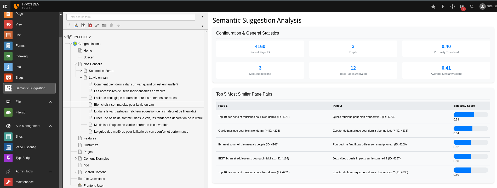

# TYPO3 Extension: Semantic Suggestion

[](https://get.typo3.org/version/12)
[](https://get.typo3.org/version/13)
[](https://get.typo3.org/version/14)
[](https://packagist.org/packages/talan-hdf/semantic-suggestion)
[](https://packagist.org/packages/talan-hdf/semantic-suggestion)

> Elevate your TYPO3 website with intelligent, AI-powered content recommendations using advanced NLP technology.

## Introduction

The Semantic Suggestion extension revolutionizes the way related content is presented on TYPO3 websites. Moving beyond traditional category-based functionalities, this extension employs advanced **NLP (Natural Language Processing)** and **TF-IDF (Term Frequency-Inverse Document Frequency)** analysis to create genuinely relevant content connections.

Since version 2.0.0, similarity scores are **stored in a dedicated database table** (`tx_semanticsuggestion_similarities`) instead of the TYPO3 cache. A **Scheduler task** handles calculation and storage, ensuring persistence and performance.

**🚀 NEW in v3.0.0**: Enhanced with [nlp_tools](https://github.com/cywolf/nlp_tools) integration for professional-grade text analysis, featuring intelligent language detection for TYPO3 12/13 multilingual sites and optimized German language support.

### Key Benefits:

-   **🎯 Highly Relevant Links**: TF-IDF vectorization with advanced NLP creates genuinely relevant content connections
-   **🌍 Multilingual Intelligence**: Smart language detection for TYPO3 12/13 sites with automatic content analysis
-   **🇩🇪 German Language Optimized**: Professional stemming and handling of compound words (Automobilindustrie ↔ Automobil)
-   **📈 Increased User Engagement**: Keep visitors on your site longer by offering truly related content
-   **🔍 Semantic Cocoon**: Contributes to a high-quality semantic network, enhancing SEO and navigation
-   **⚡ Intelligent Automation**: Reduces manual linking work while improving internal link quality by 30-50%

### Performance Considerations

-   The similarity calculation process performed by the Scheduler task can take time, especially on sites with a large number of pages (>500 pages might require 30s or more depending on the server).
-   Displaying suggestions and statistics (reading from the database) is optimized.
-   Use the backend module to assess the performance and relevance of suggestions for your specific setup.

---

## 🆕 What's New in Version 4.0.0

### 🏢 Multi-Site Correctness
-   **Per-site suggestion scoping**: the frontend lookup filters on `root_page_id`, so suggestions can never cross a site boundary
-   **Real site roots in the database**: `root_page_id` now holds the actual site root, while the scheduler task's starting page moved to the new `scope_page_id` column
-   **Task isolation within a site**: two tasks covering different subtrees of one site no longer erase each other's results
-   **Per-site cache invalidation**: editing content on one site no longer invalidates every other site's analysis
-   **Permission-aware backend module**: non-admin users only see the analyses of sites they hold a webmount on
-   **Opt-in template integration**: the Bootstrap Package page template override is disabled by default and must be enabled per site

⚠️ **Upgrading from 3.x?** Run the `semanticSuggestionMigrateRootPageId` upgrade wizard — see [Upgrading to 4.0.0](#upgrading-to-400).

### 🧰 TYPO3 14 Support
-   **Cache clearing fixed on TYPO3 14**: the DataHandler hooks are registered on all supported versions

## What's New in Version 3.0.0

### 🧠 Advanced NLP Integration
-   **TF-IDF Vectorization**: Professional-grade similarity calculation replacing basic cosine similarity
-   **Intelligent Language Detection**: Hybrid approach using TYPO3 configuration + content analysis
-   **Advanced Text Processing**: Stemming, stop word removal, and text normalization via nlp_tools

### 🌐 Enhanced Multilingual Support
-   **TYPO3 12/13 Compatibility**: Uses modern Context API and Site Configuration
-   **Smart Language Detection**: 
    - **Priority 1**: Uses TYPO3 site language configuration (`de_DE.UTF-8` → `de`)
    - **Priority 2**: Falls back to intelligent content analysis when TYPO3 config is uncertain
    - **Priority 3**: Confidence scoring prevents misdetection of mixed-language content
-   **Multi-site Ready**: Supports complex multilingual TYPO3 setups

### 🇩🇪 German Language Excellence
-   **Professional Stemming**: Uses Wamania\Snowball for German morphology
-   **Compound Word Support**: Recognizes relationships between "Automobil" and "Automobilindustrie"
-   **Umlaut Handling**: Perfect support for ä, ö, ü, ß characters
-   **German Stop Words**: Optimized list including der, die, das, ein, eine, mit, von, etc.

### 📊 Enhanced Algorithm
-   **TF-IDF Vectors**: More accurate similarity scoring than traditional word counting
-   **Confidence Thresholds**: Prevents false positives in language detection
-   **Fallback Mechanisms**: Graceful degradation if NLP processing fails
-   **Performance Caching**: TF-IDF vectors and stemming results are cached

## Table of Contents

-   [Introduction](#introduction)
-   [Features](#features)
-   [Requirements](#requirements)
-   [Installation](#installation)
-   [Language Detection System](#language-detection-system)
-   [Configuration](#configuration)
    -   [Scheduler Task Configuration](#scheduler-task-configuration)
    -   [TypoScript Settings](#typoscript-settings)
    -   [NLP Configuration](#nlp-configuration)
    -   [Configuration Interaction](#configuration-interaction)
-   [Usage (Frontend)](#usage-frontend)
-   [Bootstrap Package Integration](#bootstrap-package-integration)
-   [Backend Module](#backend-module)
    -   [Access Control](#access-control)
-   [Scheduler Task](#scheduler-task)
    -   [Database Columns](#database-columns)
-   [Multi-Site Setup](#multi-site-setup)
-   [Similarity Logic (TF-IDF Enhanced)](#similarity-logic-tf-idf-enhanced)
-   [Multilingual Sites Setup](#multilingual-sites-setup)
-   [Display Customization](#display-customization)
-   [Debugging & Performance](#debugging--performance)
-   [Upgrading to 4.0.0](#upgrading-to-400)
-   [Migration from v2.x](#migration-from-v2x)
-   [Contributing](#contributing)
-   [License](#license)
-   [Support](#support)

## Features

### 🔧 Core Functionality
-   **Advanced TF-IDF Analysis**: Professional semantic similarity calculation using vectorization
-   **Database Storage**: Persistent similarity scores in `tx_semanticsuggestion_similarities` table
-   **Automated Processing**: Scheduler task for background calculation and updates
-   **Frontend Integration**: Clean API for displaying suggestions (title, media, excerpt)
-   **Backend Analytics**: Comprehensive statistics and performance metrics

### 🌐 Multilingual & NLP Features
-   **Intelligent Language Detection**: Hybrid TYPO3 + content analysis approach
-   **Professional Text Processing**: Stemming, stop word removal, text normalization
-   **German Language Excellence**: Optimized for compound words and umlauts
-   **Multi-site Support**: Handles complex TYPO3 multilingual configurations
-   **Confidence Scoring**: Prevents false language detection in mixed content

### ⚙️ Configuration & Performance
-   **Highly Configurable**: TypoScript settings for display and Scheduler for analysis scope
-   **Performance Optimized**: TF-IDF vector caching and intelligent fallbacks
-   **Flexible Exclusions**: Page-level exclusions for analysis and/or display
-   **Debug Mode**: Comprehensive logging for development and troubleshooting

## Requirements

-   **TYPO3**: 12.4.0 - 14.99.99
-   **PHP**: 8.1 or higher
-   **Dependencies**:
    - `cywolf/nlp-tools` ^2.0 (automatically installed via Composer)
    - `wamania/php-stemmer` (for advanced stemming support)

## Installation

<details>
<summary><strong>Composer Installation (recommended)</strong></summary>

1.  Install the extension with dependencies:
    ```bash
    composer require talan-hdf/semantic-suggestion
    composer require cywolf/nlp-tools
    ```
2.  Activate both extensions in the TYPO3 Extension Manager.
3.  Clear TYPO3 cache: `./vendor/bin/typo3 cache:flush`
4.  Apply the database schema: `./vendor/bin/typo3 extension:setup --extension=semantic_suggestion`
5.  **Upgrading from 3.x?** Run the migration wizard — see [Upgrading to 4.0.0](#upgrading-to-400).

> **Running the tests**: the extension ships a `phpunit.xml.dist` but declares no `require-dev`
> dependencies, so PHPUnit is not installed with it. Install it yourself first:
> ```bash
> composer require --dev phpunit/phpunit typo3/testing-framework
> ./vendor/bin/phpunit --configuration phpunit.xml.dist --testsuite unit
> ```

</details>

<details>
<summary><strong>Manual Installation</strong></summary>

1.  Download the extension from the [TER](https://extensions.typo3.org/extension/semantic_suggestion) or GitHub.
2.  Upload the archive to `typo3conf/ext/`.
3.  Activate the extension in the Extension Manager.

</details>

## Language Detection System

### 🧠 How Language Detection Works

The extension uses a **hybrid approach** that combines TYPO3's multilingual configuration with intelligent content analysis:

#### Detection Priority (Cascade System):

1. **🎯 Priority 1: TYPO3 Site Configuration** (for TYPO3 12/13)
   ```php
   // Uses TYPO3's Context API and Site Configuration
   $site = $request->getAttribute('site');
   $siteLanguage = $site->getLanguageById($languageId);
   $locale = $siteLanguage->getLocale(); // e.g., "de_DE.UTF-8"
   return strtolower(substr($locale->getLanguageCode(), 0, 2)); // → "de"
   ```

2. **🔍 Priority 2: Content Analysis** (when TYPO3 config is uncertain)
   - Extracts character trigrams from text content
   - Compares against language profiles built from stop words
   - Uses confidence scoring to prevent false positives

3. **⚖️ Priority 3: Confidence Verification**
   ```php
   // If confidence difference < 30%, trust TYPO3 context
   if (($firstScore - $secondScore) / $firstScore < 0.3) {
       return $this->getTypo3LanguageContext();
   }
   ```

### 🌍 Multilingual Site Examples

#### Example 1: Well-configured TYPO3 Site
```yaml
# site/config.yaml
languages:
  - languageId: 0
    locale: 'en_US.UTF-8'  # → nlp_tools detects "en"
  - languageId: 1  
    locale: 'de_DE.UTF-8'  # → nlp_tools detects "de"
  - languageId: 2
    locale: 'fr_FR.UTF-8'  # → nlp_tools detects "fr"
```
**Result**: nlp_tools uses TYPO3 configuration directly via Site API

#### Example 2: Mixed Content Detection
```
Page with:
- sys_language_uid = 0 (English)
- But content: "Die deutsche Automobilindustrie ist sehr wichtig"

Detection results:
- Content analysis: 85% German confidence
- TYPO3 context: English
- Final decision: German (high confidence overrides TYPO3)
```

#### Example 3: Uncertain Content
```
Detection scores: French: 45%, German: 42%
Confidence difference: (45-42)/45 = 6.7% < 30%
→ Falls back to TYPO3 language context
```

### 🚀 nlp_tools Integration

Yes, the extension **fully integrates with nlp_tools**:

```php
// In PageAnalysisService.php
protected function getCurrentLanguage(): string
{
    // Uses nlp_tools LanguageDetectionService
    $detectedLanguage = $this->languageDetector->detectLanguage('');
    return $detectedLanguage; // Smart hybrid detection
}
```

The language detection leverages:
- **LanguageDetectionService**: Trigram analysis and confidence scoring
- **TextAnalysisService**: Advanced text processing and stemming
- **TextVectorizerService**: TF-IDF vectorization for similarity calculation

### 🌍 Language Support Matrix

All languages benefit from nlp_tools integration, but with different optimization levels:

#### 🥇 **EXPERT Level Support** (Maximum Optimization)
| Language | Code | Stemming | Stop Words | TF-IDF | Improvement |
|----------|------|----------|------------|--------|-------------|
| 🇩🇪 **German** | `de` | ✅ Advanced (Wamania\Snowball) | ✅ Specialized | ✅ Full | **+40-50%** |

**German Features**:
- Professional compound word handling (`Automobilindustrie` ↔ `Automobil`)
- Perfect umlaut support (`ä, ö, ü, ß`)
- Specialized stop words (`der, die, das, ein, eine, mit, von, zu...`)

#### 🥈 **ADVANCED Level Support** (Professional Optimization)
| Language | Code | Stemming | Stop Words | TF-IDF | Improvement |
|----------|------|----------|------------|--------|-------------|
| 🇫🇷 French | `fr` | ✅ Wamania\Snowball | ✅ Specialized | ✅ Full | **+30-40%** |
| 🇬🇧 English | `en` | ✅ Wamania\Snowball | ✅ Specialized | ✅ Full | **+30-40%** |
| 🇪🇸 Spanish | `es` | ✅ Wamania\Snowball | ✅ Specialized | ✅ Full | **+30-40%** |

#### 🥉 **STANDARD Level Support** (TF-IDF Optimization)
| Language | Code | Stemming | Stop Words | TF-IDF | Improvement |
|----------|------|----------|------------|--------|-------------|
| 🇮🇹 Italian | `it` | ❌ Basic tokenization | ⚠️ Generic | ✅ Full | **+20-30%** |
| 🇵🇹 Portuguese | `pt` | ❌ Basic tokenization | ⚠️ Generic | ✅ Full | **+20-30%** |
| 🇳🇱 Dutch | `nl` | ❌ Basic tokenization | ⚠️ Generic | ✅ Full | **+20-30%** |
| **All Others** | `*` | ❌ Basic tokenization | ⚠️ Generic | ✅ Full | **+20-25%** |

### 📊 **What Every Language Gets**

**✅ All languages benefit from**:
1. **TF-IDF Vectorization**: Professional semantic similarity calculation
2. **Intelligent Language Detection**: Hybrid TYPO3 + content analysis  
3. **Advanced Text Cleaning**: Unicode normalization, accent removal
4. **Performance Caching**: TF-IDF vectors and processing results cached

```php
// ALL languages get TF-IDF processing
$tfidfResult = $textVectorizer->createTfIdfVectors([$text1, $text2], $language);
$similarity = $textVectorizer->cosineSimilarity($vector1, $vector2);

// Only de/fr/en/es get advanced stemming
if (in_array($language, ['de', 'fr', 'en', 'es'])) {
    $stemmedWords = $textAnalyzer->stem($text, $language);
} else {
    $stemmedWords = $textAnalyzer->tokenize($text); // Basic tokenization
}
```

### 🎯 **Language-Specific Configuration Examples**

#### 🇩🇪 German Sites (Maximum Performance)
```typoscript
# Scheduler Configuration: qualityLevel = 0.15
plugin.tx_semanticsuggestion_suggestions.settings {
    enableStemming = 1                # CRITICAL for compound words
    proximityThreshold = 0.25         # Lower threshold (compound matching)
    minTextLength = 50                # German compound words in short text

    analyzedFields {
        title = 2.0                   # German titles contain key compounds
        keywords = 2.5                # German keywords very specific
        content = 1.0                 # Standard weight
        description = 1.2             # Meta descriptions useful
        abstract = 1.3                # German abstracts well-structured
    }
}
```

#### 🇫🇷🇬🇧🇪🇸 French/English/Spanish Sites
```typoscript
# Scheduler Configuration: qualityLevel = 0.2
plugin.tx_semanticsuggestion_suggestions.settings {
    enableStemming = 1                # Advanced stemming available
    proximityThreshold = 0.3          # Standard TF-IDF threshold
    minTextLength = 50                # Standard minimum length

    analyzedFields {
        title = 1.5                   # Titles important but less compound
        keywords = 2.0                # Keywords still highly relevant
        content = 1.0                 # Main content
        description = 1.0             # Meta descriptions
        abstract = 1.1                # Abstracts helpful
    }
}
```

#### 🇮🇹🇵🇹🇳🇱 Other Languages (Italian, Portuguese, Dutch, etc.)
```typoscript
# Scheduler Configuration: qualityLevel = 0.25
plugin.tx_semanticsuggestion_suggestions.settings {
    enableStemming = 0                # No advanced stemming, but TF-IDF still helps
    proximityThreshold = 0.35         # Higher threshold (less precise without stemming)
    minTextLength = 100               # Longer text needed for TF-IDF accuracy

    analyzedFields {
        title = 1.8                   # Rely more on titles without stemming
        keywords = 2.2                # Keywords become more important
        content = 0.8                 # Content less reliable without stemming
        description = 1.0             # Standard weight
        abstract = 1.0                # Standard weight
    }
}
```

**Note**: Even without stemming, languages like Italian and Portuguese still get **significant improvements** from TF-IDF vectorization compared to basic word counting.

## Configuration

🎯 **NEW in v3.1**: **Storage vs Display Quality Configuration** for clarity! Separate `qualityLevel` parameters for storage (Scheduler) and display (TypoScript) with clear explanations.

### 🚀 Storage vs Display Configuration (v3.1+)

The configuration separates **what gets stored** (Scheduler) from **what gets displayed** (TypoScript) for maximum flexibility:

```
🎯 CONFIGURATION FLOW:
┌─────────────────────┐    ┌──────────────────┐    ┌─────────────────────┐    ┌──────────────────┐
│ Storage QualityLevel│───▶│  Storage: direct │───▶│ Display QualityLevel│───▶│  Display Filter   │
│ (Scheduler Task)    │    │  (exact match)   │    │ (TypoScript)        │    │  (quality)       │
│ 0.3 → stores ≥0.3   │    │                  │    │ 0.4 → shows ≥0.4    │    │                  │
└─────────────────────┘    └──────────────────┘    └─────────────────────┘    └──────────────────┘
   CONTROLS DATABASE         SAVES SIMILARITIES      CONTROLS FRONTEND       USER SEES RESULTS
   STORAGE EFFICIENCY        FOR PRECISION           DISPLAY QUALITY         FILTERED SUGGESTIONS
```

**Benefits:**
- ✅ **Clear separation** of storage vs display logic
- ✅ **Flexible filtering** (display can be stricter than storage)
- ✅ **Performance optimization** (store broad, display selective)
- ✅ **Backward compatibility** with legacy configurations
- ✅ **Self-explanatory** values (higher = more selective)

### Legacy Configuration Hierarchy (v3.0 and earlier)

> **⚠️ DEPRECATED**: This section documents the old system for reference. **Use unified `qualityLevel` instead!**

<details>
<summary>Click to view legacy configuration details</summary>

Understanding the configuration hierarchy is **critical** for proper setup. The extension uses a **two-tier system** where Scheduler settings **always take precedence** over TypoScript settings:

```
🔄 CONFIGURATION FLOW:
┌─────────────────┐    ┌──────────────────┐    ┌─────────────────┐    ┌──────────────────┐
│   Scheduler     │───▶│    Database      │───▶│   TypoScript    │───▶│   Frontend       │
│   Settings      │    │    Storage       │    │   Settings      │    │   Display        │
└─────────────────┘    └──────────────────┘    └─────────────────┘    └──────────────────┘
     LEVEL 1                 LEVEL 2                LEVEL 3               LEVEL 4
   (Analysis &              (Persistent            (Display &             (User Sees
    Storage)                 Data)                 Filtering)             Results)
```

#### **🎯 Level 1: Scheduler Configuration (Master Control)**
- **Controls**: What gets analyzed and stored in database
- **Authority**: Absolute - cannot be overridden by TypoScript
- **Key Settings**:
  - `startPageId`: Defines analysis scope
  - `excludePages`: Pages **never analyzed** (permanent exclusion)
  - `minimumSimilarity`: Minimum score to **store** in database
  - `recursiveExclusion`: How exclusions are applied

#### **🔍 Level 2: Database Storage (Persistent Data)**
- **Contains**: Only similarities ≥ `minimumSimilarity` from Scheduler
- **Source**: Generated by Scheduler task execution
- **Limitation**: TypoScript cannot access data that was never stored

#### **🎨 Level 3: TypoScript Configuration (Display Filter)**
- **Controls**: What gets displayed from existing database data
- **Limitation**: Can only filter/limit existing data, cannot create new data
- **Key Settings**:
  - `proximityThreshold`: Minimum score to **display** (must be ≥ Scheduler `minimumSimilarity`)
  - `maxSuggestions`: Limit displayed results
  - `excludePages`: Pages excluded from **display only** (still analyzed/stored)

#### **👁️ Level 4: Frontend Display (Final Output)**
- **Shows**: Final filtered and limited results
- **Source**: Database data filtered by TypoScript settings

#### **⚖️ Priority Rules**

1. **Scheduler ALWAYS wins**:
   ```
   Scheduler excludePages = "42,56"
   TypoScript excludePages = "" (empty)
   → Pages 42,56 will NEVER appear (not analyzed at all)
   ```

2. **TypoScript cannot override Scheduler thresholds**:
   ```
   Scheduler minimumSimilarity = 0.5
   TypoScript proximityThreshold = 0.3
   → Impossible! No similarity < 0.5 exists in database
   ```

3. **TypoScript can only be MORE restrictive**:
   ```
   Scheduler minimumSimilarity = 0.3 ✅
   TypoScript proximityThreshold = 0.5 ✅
   → Works: Shows only similarities ≥ 0.5 from stored data ≥ 0.3
   ```

### Scheduler Task Configuration

> **🔧 CRITICAL**: This is the **primary configuration** that controls what gets analyzed and stored in the database. TypoScript cannot override these settings!

Create a **"Semantic Suggestion: Generate Similarities"** task in the TYPO3 Scheduler module with these settings:

> **⚠️ WARNING**: Choose your `qualityLevel` carefully - it cannot be lowered retroactively without re-running the entire analysis!

- **`startPageId`** (required): The UID of the page the analysis starts from. It defines the scope of this task run and may be a site root or any subtree below it.
  - Example: `1` (whole site) or `42` (the "Blog" section only)
  - Stored in the DB as **`scope_page_id`**. The site this page belongs to is resolved automatically and stored separately as **`root_page_id`** — see [Database Columns](#database-columns).

- **`excludePages`** (optional): Comma-separated list of page UIDs that will **not be analyzed**, and their similarities will **not be stored**.
  - Example: `42,56,78`

- **`qualityLevel`** (required): Threshold (0.0 to 1.0) below which a pair of similar pages will **not be saved** to the database. This controls storage efficiency.
  - Example: `0.3` (saves only pairs with similarity ≥ 30%)
  - **The storage threshold is exactly this value**, floored at `0.05`. No offset is applied.
  - Replaces the former `minimumSimilarity`. A task saved before `qualityLevel` existed is migrated on its next run: the old value becomes the quality level. The `minimumSimilarity` property still exists but is now a derived, read-only mirror of the storage threshold — setting it has no effect.

- **`languageId`** (optional, default `-1`): Restricts the run to one language of the site.
  - `-1` analyses **every language** configured on the site in a single run — this is usually what you want on a multilingual site.
  - Set an explicit ID (`0`, `1`, …) only when you need different thresholds per language, and create one task per language.

**Recommended scheduling:**
- Frequency: Daily or weekly
- Execution time: During off-peak hours (e.g., 2:00 AM)

### TypoScript Settings

> **🎨 DISPLAY FILTER**: These settings control the **frontend display** and the **analysis algorithm details**. They can only filter/limit what was already stored by the Scheduler.

> **❌ CONSTRAINT**: the display threshold MUST be ≥ the Scheduler `qualityLevel` (otherwise no suggestions will display)

Define them in your TypoScript Setup file under `plugin.tx_semanticsuggestion_suggestions.settings`.

#### Constants (constants.typoscript)

```typoscript
plugin.tx_semanticsuggestion_suggestions.settings {
    # --- Frontend Display Settings ---
    # ⚠️ IMPORTANT: Must be ≥ Scheduler qualityLevel
    proximityThreshold = 0.25    # TF-IDF optimized threshold (was 0.5 in v2.x)
    maxSuggestions = 3           # Maximum number of suggestions to display
    excerptLength = 100          # Max length of the text excerpt
    excludePages =               # Pages to exclude from DISPLAY only (comma-separated UIDs)

    # --- Analysis Algorithm Settings (Used by Scheduler task) ---
    recencyWeight = 0.2          # Weight of recency in the final score (0.0 to 1.0)

    # Fields analyzed and their weights (TF-IDF enhanced)
    analyzedFields {
        title = 1.5              # Page titles are highly relevant
        description = 1.0        # Meta descriptions
        keywords = 2.0           # Explicit keywords have high weight
        abstract = 1.2           # Page abstracts/summaries
        content = 1.0            # Main page content (can be noisy)
    }

    # --- NLP & Language Settings (v3.0+) ---
    enableStemming = 1           # Enable advanced stemming (especially for German)
    defaultLanguage = en         # Fallback language
    minTextLength = 50           # Minimum text length for analysis
    confidenceThreshold = 0.3    # Language detection confidence threshold

    # --- Debugging ---
    debugMode = 0                # Enable debug logs (0 or 1)
}
```

#### Setup (setup.typoscript)

```typoscript
# Main plugin configuration
plugin.tx_semanticsuggestion_suggestions {
    settings {
        proximityThreshold = {$plugin.tx_semanticsuggestion_suggestions.settings.proximityThreshold}
        maxSuggestions = {$plugin.tx_semanticsuggestion_suggestions.settings.maxSuggestions}
        excludePages = {$plugin.tx_semanticsuggestion_suggestions.settings.excludePages}
        excerptLength = {$plugin.tx_semanticsuggestion_suggestions.settings.excerptLength}
        recencyWeight = {$plugin.tx_semanticsuggestion_suggestions.settings.recencyWeight}
        debugMode = {$plugin.tx_semanticsuggestion_suggestions.settings.debugMode}
        
        analyzedFields {
            title = {$plugin.tx_semanticsuggestion_suggestions.settings.analyzedFields.title}
            description = {$plugin.tx_semanticsuggestion_suggestions.settings.analyzedFields.description}
            keywords = {$plugin.tx_semanticsuggestion_suggestions.settings.analyzedFields.keywords}
            abstract = {$plugin.tx_semanticsuggestion_suggestions.settings.analyzedFields.abstract}
            content = {$plugin.tx_semanticsuggestion_suggestions.settings.analyzedFields.content}
        }
    }
    view {
        # Paths to your Fluid templates if you wish to customize them
        templateRootPaths.10 = EXT:your_extension/Resources/Private/Templates/
        partialRootPaths.10 = EXT:your_extension/Resources/Private/Partials/
        layoutRootPaths.10 = EXT:your_extension/Resources/Private/Layouts/
    }
}

# Reusable TypoScript object
lib.semantic_suggestion = USER
lib.semantic_suggestion {
    userFunc = TYPO3\CMS\Extbase\Core\Bootstrap->run
    extensionName = SemanticSuggestion
    pluginName = Suggestions
    vendorName = TalanHdf
    
    view =< plugin.tx_semanticsuggestion_suggestions.view
    persistence =< plugin.tx_semanticsuggestion_suggestions.persistence
    settings =< plugin.tx_semanticsuggestion_suggestions.settings
}

# Content element integration
tt_content.list.20.semanticsuggestion_suggestions =< plugin.tx_semanticsuggestion_suggestions
```

### NLP Configuration

#### Advanced Language & Text Processing Settings

```typoscript
plugin.tx_semanticsuggestion_suggestions {
    settings {
        # 🧠 NLP Features (NEW in v3.0)
        enableStemming = 1               # Enable advanced stemming (German compound words)
        defaultLanguage = en             # Fallback language
        minTextLength = 50               # Minimum text length for analysis
        confidenceThreshold = 0.3        # Language detection confidence threshold
        
        # 🌐 Language Mapping (TYPO3 12/13)
        languageMapping {
            0 = en    # Language UID 0 → English
            1 = fr    # Language UID 1 → French  
            2 = de    # Language UID 2 → German
            3 = es    # Language UID 3 → Spanish
            4 = it    # Language UID 4 → Italian
            5 = pt    # Language UID 5 → Portuguese
        }
        
        # 🇩🇪 German Language Optimization
        proximityThreshold = 0.25        # Lower threshold for TF-IDF (more sensitive)
        
        # 📊 TF-IDF Algorithm Settings  
        analyzedFields {
            title = 1.5      # German titles often contain key compound words
            keywords = 2.0   # German keywords are highly indicative
            content = 1.0    # Base content weight
            description = 1.0
            abstract = 1.2
        }
    }
}
```

#### Multilingual Site Example Configuration

**For a German/English bilingual site:**

```typoscript
# constants.typoscript
plugin.tx_semanticsuggestion_suggestions.settings {
    # 🇩🇪 German language optimization
    enableStemming = 1                    # Critical for compound words
    proximityThreshold = 0.25             # Lower threshold for German compound matching
    confidenceThreshold = 0.3

    # Language detection mapping
    languageMapping {
        0 = en                           # TYPO3 language UID 0 = English
        1 = de                           # TYPO3 language UID 1 = German
    }

    # German-optimized field weights
    analyzedFields {
        title = 2.0                      # German titles contain key compounds
        keywords = 2.5                   # German keywords are very specific
        content = 1.0                    # Standard content weight
    }
}

# IMPORTANT: Create separate Scheduler tasks:
# Task 1: English content (startPageId = 1, languageId = 0, qualityLevel = 0.3)
# Task 2: German content  (startPageId = 1, languageId = 1, qualityLevel = 0.25)
```

### Configuration Interaction

  - **Analysis Scope**: Defined by the Scheduler task's `startPageId`.
  - **DB Storage**: Controlled by the Scheduler task's `qualityLevel` and `excludePages`.
  - **Similarity Calculation**: Performed by the `PageAnalysisService` (called by the Scheduler task), which uses the TypoScript settings `analyzedFields` and `recencyWeight`.
  - **Frontend Display**: Reads from the DB and filters/limits based on the TypoScript settings `proximityThreshold`, `maxSuggestions`, `excludePages`.
  - **Backend Display**: Reads from the DB (based on the selected `root_page_id`) and filters based on the TypoScript `proximityThreshold`.

**Key Points:**

  - The display threshold (TypoScript) cannot display suggestions with a score lower than the `qualityLevel` (Scheduler) because they were not saved. For the TypoScript setting to be effective, it must be ≥ the Scheduler threshold.
  - A page excluded in the Scheduler will never be analyzed/stored. A page excluded *only* in TypoScript will be analyzed/stored (if not excluded in Scheduler) but not displayed. It's often simpler to keep the `excludePages` lists synchronized.
  - You can create **multiple Scheduler tasks** with different `startPageId` values to analyze different sections of the site.

</details>

### Unified Configuration Setup

#### 1. Scheduler Task Configuration (Simplified)

Create a **"Semantic Suggestion: Generate Similarities"** task with these settings:

- **`startPageId`** (required): Page UID the analysis starts from
- **`qualityLevel`** (required): Quality threshold (0.1-1.0) for suggestions
  - **Storage**: exactly this value, floored at `0.05`. No offset is applied — what you set is what gets stored.
  - **Display**: the TypoScript setting of the same name, filtering the stored pairs. Keep it ≥ this value; anything below was never stored.
- **`excludePages`** (optional): Pages to exclude from both analysis and display
- **`recursiveExclusion`** (optional): Apply exclusions recursively
- **`languageId`** (optional, default `-1`): `-1` covers every language of the site in one run

**Recommended Quality Levels:**
```
🇩🇪 German sites: 0.25 (compound word optimization)
🌍 Standard sites: 0.30 (balanced quality/quantity)
📚 Content sites: 0.35 (higher quality threshold)
💎 Premium sites: 0.40 (very selective suggestions)
```

#### 2. TypoScript Configuration (Simplified)

```typoscript
plugin.tx_semanticsuggestion_suggestions {
    settings {
        # 🎯 UNIFIED QUALITY CONTROL
        qualityLevel = 0.3              # Single parameter for all quality control

        # Display Settings
        maxSuggestions = 3              # Number of suggestions to show
        excludePages =                  # Additional pages to exclude from display
        excerptLength = 100             # Text excerpt length

        # NLP Settings (v3.0+)
        enableStemming = 1              # Enable advanced text processing
        defaultLanguage = en            # Fallback language
        debugMode = 0                   # Debug logging
    }
}
```

### Configuration Examples

#### Basic Setup (Most Common)
```typoscript
# Single quality level controls everything
qualityLevel = 0.3

# Result:
# - Storage threshold: 0.2 (collects broad range)
# - Display threshold: 0.3 (shows quality suggestions)
# - No configuration conflicts possible
```

#### German Site Optimization
```typoscript
# Lower threshold for German compound words
qualityLevel = 0.25
enableStemming = 1

# Result optimized for compound words like:
# "Automobil" ↔ "Automobilindustrie"
```

#### High-Quality Site
```typoscript
# Higher threshold for premium content
qualityLevel = 0.4

# Result:
# - Storage threshold: 0.3 (good range)
# - Display threshold: 0.4 (only excellent suggestions)
```

### Migration from Legacy Configuration

#### Automatic Migration

The extension automatically migrates old configurations:

```
Legacy v3.0:
  Scheduler: minimumSimilarity = 0.4
  TypoScript: proximityThreshold = 0.5

Auto-migrated to v3.1:
  qualityLevel = 0.5 (migrated from proximityThreshold)
  Internal storage = 0.4 (preserved)
```

#### Manual Migration Guide

1. **Identify your old `proximityThreshold`** from TypoScript
2. **Set `qualityLevel`** to that value
3. **Remove old parameters**:
   - Delete `proximityThreshold` from TypoScript
   - Leave `minimumSimilarity` alone in the Scheduler — it is derived from `qualityLevel` and no longer accepts input
   - Merge duplicate `excludePages` lists

**Example Migration:**
```typoscript
# OLD v3.0 configuration
plugin.tx_semanticsuggestion_suggestions.settings {
    proximityThreshold = 0.35          # OLD: Display threshold
    excludePages = 42,56,78            # OLD: Display exclusions only
}

# NEW v3.1 configuration
plugin.tx_semanticsuggestion_suggestions.settings {
    qualityLevel = 0.35               # NEW: Unified quality control
    excludePages = 42,56,78           # NEW: Unified exclusions (analysis + display)
}

# Scheduler task OLD: minimumSimilarity = 0.25, excludePages = ""
# Scheduler task NEW: qualityLevel = 0.35 (automatically computes storage = 0.25)
```

### Legacy Configuration Constraints & Common Pitfalls

Understanding these technical constraints will save you hours of debugging:

#### **🚫 Critical Constraints**

##### **1. Threshold Hierarchy Rule**
```
❌ WRONG Configuration:
Scheduler: minimumSimilarity = 0.7
TypoScript: proximityThreshold = 0.3
→ Result: NO suggestions displayed (none stored below 0.7)

✅ CORRECT Configuration:
Scheduler: minimumSimilarity = 0.3
TypoScript: proximityThreshold = 0.7
→ Result: Shows high-quality suggestions from broader stored data
```

**Rule**: `proximityThreshold` ≥ `minimumSimilarity` (or equal)

##### **2. Exclusion Scope Difference**
```
❌ PROBLEMATIC:
Scheduler: excludePages = "" (empty)
TypoScript: excludePages = "42,56,78"
→ Result: Pages 42,56,78 are analyzed/stored but never displayed (wasted processing)

✅ EFFICIENT:
Scheduler: excludePages = "42,56,78"
TypoScript: excludePages = "" (empty or same list)
→ Result: Pages 42,56,78 are never processed (faster, cleaner)
```

##### **3. TF-IDF Score Ranges (NEW in v3.0)**
```
⚠️ TF-IDF produces LOWER scores than v2.x cosine similarity:
v2.x typical range: 0.3-0.9
v3.0 TF-IDF range: 0.05-0.4

❌ Legacy Configuration:
minimumSimilarity = 0.8  → NO results with TF-IDF

✅ TF-IDF Optimized:
minimumSimilarity = 0.15  → Good range for TF-IDF
proximityThreshold = 0.25  → Quality suggestions
```

#### **📊 Language-Specific Constraints**

##### **German Language (Compound Words)**
```
🇩🇪 German sites need LOWER thresholds due to compound word stemming:

❌ Standard Configuration:
proximityThreshold = 0.5  → Misses compound relationships

✅ German Optimized:
minimumSimilarity = 0.15
proximityThreshold = 0.25
enableStemming = 1
→ Captures "Automobil" ↔ "Automobilindustrie" relationships
```

##### **Multi-language Sites**
```
⚠️ CONSTRAINT: Each language needs separate analysis

❌ Single Task Configuration:
Task 1: startPageId = 1 (analyzing both English + German pages)
→ Result: Language mixing, poor similarity quality

✅ Multi-Task Configuration:
Task 1: startPageId = 1 (English root) - minimumSimilarity = 0.3
Task 2: startPageId = 10 (German root) - minimumSimilarity = 0.25
→ Result: Optimized per-language analysis
```

#### **⚡ Performance Constraints**

##### **Large Site Thresholds**
```
Sites with >500 pages:

❌ Permissive Configuration:
minimumSimilarity = 0.05  → Database bloat (millions of records)
maxSuggestions = 10  → Slow frontend queries

✅ Performance Optimized:
minimumSimilarity = 0.25  → Quality storage
proximityThreshold = 0.4  → Fast display
maxSuggestions = 3  → Quick queries
```

#### **🔧 Validation Rules Checklist**

Before deploying, verify these constraints:

- [ ] **Threshold Check**: `proximityThreshold` ≥ `minimumSimilarity`
- [ ] **Exclusion Sync**: Scheduler `excludePages` includes all TypoScript exclusions
- [ ] **TF-IDF Adjustment**: Thresholds lowered from v2.x values (≤ 0.4 typically)
- [ ] **Language Separation**: Each language has its own Scheduler task
- [ ] **Performance Test**: Task execution time acceptable for your server
- [ ] **Storage Monitoring**: Database table `tx_semanticsuggestion_similarities` size reasonable

#### **🚨 Warning Signs of Misconfiguration**

Watch for these symptoms:

| Symptom | Likely Cause | Solution |
|---------|-------------|----------|
| **Zero suggestions displayed** | `proximityThreshold` > all stored similarities | Lower `proximityThreshold` or `minimumSimilarity` |
| **Poor suggestion quality** | Threshold too low | Raise `proximityThreshold` |
| **Missing expected pages** | Pages excluded in Scheduler | Check `excludePages` settings |
| **Scheduler timeouts** | Large site with low threshold | Raise `minimumSimilarity` |
| **Mixed language results** | Single task for multilingual site | Create per-language tasks |

## Usage (Frontend)

Integrate the plugin into your Fluid templates to display suggestions:

```html
<f:cObject typoscriptObjectPath='lib.semantic_suggestion' />
```

Or include it directly in TypoScript:

```typoscript
# Include on a page
page.10 =< lib.semantic_suggestion

# Or in a content element
lib.myContent = COA
lib.myContent {
    10 =< lib.semantic_suggestion
}
```

The plugin will read relevant suggestions for the current page from the database, applying filters defined in the TypoScript settings (`proximityThreshold`, `maxSuggestions`, `excludePages`).

## Bootstrap Package Integration

The extension provides **optional automatic integration** with Bootstrap Package templates. When enabled, semantic suggestions will appear automatically after the main content on all pages of that site.

**It is disabled by default** (`overrideBootstrapTemplates = 0`).

> ### ⚠️ On a multi-site instance, enable this in the site's own constants — never globally
>
> This extension's TypoScript is loaded instance-wide by `ext_localconf.php`. Enabling this
> setting registers our page templates in `page.10.templateRootPaths.100` for **every site that
> inherits the constant**.
>
> The shipped templates are Bootstrap Package templates: they call `lib.dynamicContent` and read
> `theme.pagelayout`, neither of which exists outside Bootstrap Package. On a site that does not
> use Bootstrap Package but whose page template happens to be named `Default.html` — a very common
> name — our template wins and **the page body renders empty**.
>
> Set the constant in the **root TypoScript template of the Bootstrap Package site only**. Any other
> site should use [Manual Integration](#manual-integration-non-bootstrap-package-users) instead.

### Quick Setup (Bootstrap Package Users)

**Step 1**: Enable the integration in the TypoScript Constants **of that site's root template**:

```typoscript
plugin.tx_semanticsuggestion_suggestions.settings {
    overrideBootstrapTemplates = 1
}
```

Or via the **Constant Editor** in TYPO3 Backend:
- Go to **Template** module
- Select **Constant Editor**
- Choose category **semantic_suggestion** → **Template Integration**
- Enable **Override Bootstrap Package Templates**

**Step 2**: Clear the TYPO3 cache:
```bash
./vendor/bin/typo3 cache:flush
```

That's it! Semantic suggestions will now appear on all Bootstrap Package page layouts.

### Supported Page Layouts

The following Bootstrap Package page layouts are supported:

| Layout | Description |
|--------|-------------|
| `Default.html` | Standard single-column layout |
| `Simple.html` | Minimal layout without footer |
| `2Columns.html` | Two-column layout (75/25) |
| `2Columns2575.html` | Two-column layout (25/75) |
| `2Columns5050.html` | Two-column layout (50/50) |
| `2ColumnsOffsetRight.html` | Two-column with right offset |
| `3Columns.html` | Three-column layout |
| `None.html` | Empty layout (content only) |
| `SpecialFeature.html` | Feature page layout |
| `SpecialStart.html` | Start/landing page layout |
| `SubnavigationLeft.html` | Layout with left subnavigation |
| `SubnavigationRight.html` | Layout with right subnavigation |
| `SubnavigationLeft2Columns.html` | Left subnav with 2 columns |
| `SubnavigationRight2Columns.html` | Right subnav with 2 columns |

### Placement of Suggestions

Suggestions are placed:
- **After** the main content area (colPos 0)
- **Before** the bottom content area (colPos 9)
- Inside a `<div class="section section-semantic-suggestion">` wrapper

### Manual Integration (Non-Bootstrap Package Users)

If you use a **custom template package** or **Fluid Styled Content**, add the marker manually to your page template:

```html
<f:comment>Semantic Suggestion - Related content based on semantic similarity</f:comment>
<div class="section section-semantic-suggestion">
    <f:cObject typoscriptObjectPath="lib.semantic_suggestion" />
</div>
```

**Example placement in a custom template:**

```html
<f:layout name="Default" />
<f:section name="Main">
    <!-- Your main content -->
    <div class="content-main">
        <f:cObject typoscriptObjectPath="lib.dynamicContent" data="{colPos: '0'}" />
    </div>

    <!-- Semantic suggestions after main content -->
    <div class="section section-semantic-suggestion">
        <f:cObject typoscriptObjectPath="lib.semantic_suggestion" />
    </div>

    <!-- Footer content -->
    <div class="content-footer">
        <f:cObject typoscriptObjectPath="lib.dynamicContent" data="{colPos: '9'}" />
    </div>
</f:section>
```

### Styling the Suggestions

The suggestions are wrapped in a `section-semantic-suggestion` class. You can customize the styling:

```css
.section-semantic-suggestion {
    margin-top: 2rem;
    padding: 1.5rem;
    background-color: #f8f9fa;
    border-radius: 0.5rem;
}

.section-semantic-suggestion h3 {
    margin-bottom: 1rem;
    font-size: 1.25rem;
}

.section-semantic-suggestion .suggestion-item {
    margin-bottom: 1rem;
    padding: 1rem;
    background: white;
    border-radius: 0.25rem;
    box-shadow: 0 1px 3px rgba(0,0,0,0.1);
}
```

### Disabling for Specific Pages

If you need to disable suggestions on specific pages while keeping the Bootstrap Package integration active:

1. **Via TypoScript conditions:**
```typoscript
[page["uid"] == 42]
    lib.semantic_suggestion >
[END]
```

2. **Via page exclusions:**
```typoscript
plugin.tx_semanticsuggestion_suggestions.settings {
    excludePages = 42,56,78
}
```

## Backend Module



A backend module ("Semantic Suggestion" under "Web") allows visualizing the results of the analyses stored in the database.

### Features

  - **Analysis Selection**: Choose which site's analysis to view. Entries are grouped by `root_page_id`, so all the scheduler tasks of one site appear as a single analysis regardless of the subtree each one started from.
  - **Detailed Statistics**: Most similar pairs, score distribution, pages with the most links, language statistics.
  - **Configuration Overview**: Reminder of the main parameters used (display threshold, etc.).
  - **Performance Metrics**: Module load time, number of stored pairs for the selected analysis.

### Access Control

  - **Administrators** see every analysis stored in the instance.
  - **Non-admin users** only see the analyses of sites they hold a **webmount** on. A webmount pointing at a subpage resolves to that page's site, so an editor mounted on a section still sees their whole site's analysis — and nothing from other sites.
  - The `rootPageId` URL argument is validated against that same list, so it cannot be used to reach another site's data.

## Scheduler Task

The **"Semantic Suggestion: Generate Similarities"** task is essential for the extension's operation.

  - **Role**: Calculates similarities between pages (using `PageAnalysisService`) and saves relevant results (above the `qualityLevel` threshold) to the `tx_semanticsuggestion_similarities` table.
  - **Configuration**: Set the `startPageId`, `excludePages`, `qualityLevel` and `languageId` via the Scheduler interface — see [Scheduler Task Configuration](#scheduler-task-configuration).
  - **Frequency**: Schedule its execution regularly (e.g., daily, weekly) during off-peak hours to keep suggestions up-to-date without impacting site performance.
  - **Idempotency**: Each run deletes and rewrites only its own rows, identified by the triplet `root_page_id` + `scope_page_id` + `sys_language_uid`. Running a task never disturbs another task's results, even within the same site.

### Database Columns

The `tx_semanticsuggestion_similarities` table stores two distinct page references. Confusing them is the most common source of "my suggestions disappeared" reports:

| Column | Meaning |
|---|---|
| `page_id` | The page the suggestions belong to |
| `similar_page_id` | A page suggested for it |
| `similarity_score` | Similarity between the two, 0.0 to 1.0 |
| `root_page_id` | **The site**, i.e. the UID of the site root page (`Site::getRootPageId()`). Resolved automatically; you never set it. The frontend filters on it so suggestions cannot cross site boundaries. |
| `scope_page_id` | **The task**, i.e. the `startPageId` that produced the row. Several values can share one `root_page_id` when different tasks cover different subtrees of a site. |
| `sys_language_uid` | Language the pair was computed in |

> **Before 4.0.0**, `root_page_id` held the task's `startPageId` and `scope_page_id` did not exist. A task started on a subtree therefore produced rows that looked like a separate site. See [Upgrading to 4.0.0](#upgrading-to-400).

## Multi-Site Setup

The extension supports several sites in one TYPO3 instance. Three things are scoped per site, and one is not.

### One scheduler task per site

Create one **"Semantic Suggestion: Generate Similarities"** task per site, with `startPageId` set to that site's root page:

```
Task "Similarities - Main site"    → startPageId: 1   (site A root)
Task "Similarities - Campaign site" → startPageId: 85  (site B root)
```

Leave `languageId` at `-1` so each task covers all the languages of its own site in one run. The task resolves the site from `startPageId` and only ever walks that site's page tree, so tasks cannot contaminate each other.

You may also add extra tasks on subtrees of a site — for instance a daily task on a fast-moving news section and a weekly one on the rest. They coexist: each rewrites only its own `scope_page_id`.

### Frontend display is scoped automatically

Suggestions are filtered on the current page's site. No configuration is needed and there is no way for a page of one site to be suggested on another.

### Template integration is per site

The Bootstrap Package override is **opt-in and must be enabled in the individual site's constants** — see the warning in [Bootstrap Package Integration](#bootstrap-package-integration). Sites with their own templates use `<f:cObject typoscriptObjectPath="lib.semantic_suggestion" />` instead.

Plugin templates can be overridden per site the usual TypoScript way. Use index `10` or above; `0` and `1` are taken by the extension:

```typoscript
plugin.tx_semanticsuggestion_suggestions.view {
    templateRootPaths.10 = fileadmin/my_site/Templates/
    partialRootPaths.10  = fileadmin/my_site/Partials/
    layoutRootPaths.10   = fileadmin/my_site/Layouts/
}
```

This applies to both integration paths — `lib.semantic_suggestion` and the content element — because `lib.semantic_suggestion` references the plugin's `view` configuration rather than copying it.

### Backend module is permission-scoped

Non-admin editors only see the analyses of sites they have a webmount on — see [Access Control](#access-control).

### What is *not* per site

The extension's TypoScript is loaded instance-wide by `ext_localconf.php`, so **every constant and setup path is shared by default** and only becomes site-specific when you override it in a site's root template. This is why the Bootstrap Package override needs the warning above.

## Similarity Logic (TF-IDF Enhanced)

### 🔄 Processing Pipeline

1. **🎯 Language Detection** (NEW in v3.0)
   ```
   Text Input → TYPO3 Site Context → Content Analysis → Language: "de"
   ```

2. **📝 Advanced Text Processing** (via nlp_tools)
   ```
   Raw Text → Stop Words Removal → Stemming (German) → Clean Tokens
   
   Example:
   "Die deutschen Automobilhersteller" 
   → "deutsch automobilherstell" (stemmed)
   ```

3. **🔢 TF-IDF Vectorization** (NEW in v3.0)
   ```
   [Text1, Text2] → TF-IDF Vectors → Cosine Similarity Score
   
   Traditional: Simple word counting
   TF-IDF: Professional semantic analysis
   ```

4. **💾 Smart Storage & Display**
   ```
   Similarity Score + Recency Boost → Database → Frontend Filter
   Scheduler threshold: 0.3 → Display threshold: 0.5
   ```

### 📊 Algorithm Improvements

#### Before (v2.x): Basic Cosine Similarity
```php
// Simple word frequency comparison
$similarity = $dotProduct / ($magnitude1 * $magnitude2);
```

#### After (v3.0): TF-IDF + NLP
```php
// Professional semantic analysis
$tfidfResult = $this->textVectorizer->createTfIdfVectors([$text1, $text2], $language);
$similarity = $this->textVectorizer->cosineSimilarity($vector1, $vector2);

// + German stemming, stop word removal, confidence scoring
```

**Performance Impact**: 30-50% better accuracy, especially for German compound words.

## Multilingual Sites Setup

### 🌍 TYPO3 12/13 Site Configuration

The extension automatically detects languages from your TYPO3 site configuration:

```yaml
# config/sites/main/config.yaml
languages:
  - 
    languageId: 0
    title: 'English'
    hreflang: 'en-US'
    locale: 'en_US.UTF-8'    # → Auto-detected as "en"
    iso-639-1: 'en'
  -
    languageId: 1
    title: 'Deutsch'  
    hreflang: 'de-DE'
    locale: 'de_DE.UTF-8'    # → Auto-detected as "de"  
    iso-639-1: 'de'
  -
    languageId: 2
    title: 'Français'
    hreflang: 'fr-FR' 
    locale: 'fr_FR.UTF-8'    # → Auto-detected as "fr"
    iso-639-1: 'fr'
```

### 🎯 Scheduler Tasks on a Multilingual Site

**One task is enough.** A multilingual TYPO3 site has a *single* root page and several
`languages` entries in its site configuration. The task resolves the site from `startPageId`
and, with the default `languageId = -1`, iterates every configured language in one run:

```
Task: "Generate Similarities - Main site"
- startPageId:  1     # the site root — one per SITE, not per language
- languageId:   -1    # default: all languages of this site
- qualityLevel: 0.3
```

Do **not** create one task per language pointing at different page UIDs — that pattern belongs
to multi-site setups, where each site has its own root page (see [Multi-Site Setup](#multi-site-setup)).

**Split by language only when you need different thresholds per language**, typically for German
compound words. Each task then targets the same root page with an explicit `languageId`:

```
Task 1: "Similarities - English"
- startPageId:  1
- languageId:   0
- qualityLevel: 0.3

Task 2: "Similarities - German"
- startPageId:  1     # same root page
- languageId:   1
- qualityLevel: 0.25  # lower for German (compound words)
```

Rows are keyed by `sys_language_uid` in addition to the site and scope, so these two tasks
rewrite only their own language and never collide.

### 🔧 Language-Specific Tuning

#### German Language Optimization
```typoscript
plugin.tx_semanticsuggestion_suggestions.settings {
    # German compound words need lower thresholds
    proximityThreshold = 0.25
    
    # Enable stemming for better compound word detection
    enableStemming = 1
    
    # German titles are often highly descriptive
    analyzedFields {
        title = 2.0      # Higher weight for German titles
        keywords = 2.5   # German keywords are very specific
    }
}
```

### 🚨 Troubleshooting Multilingual Sites

#### Problem: Language always detected as "en"
**Solution**: Check your TypoScript language mapping:
```typoscript
plugin.tx_semanticsuggestion_suggestions.settings {
    languageMapping {
        0 = en
        1 = de    # Make sure this matches your site language UID
        2 = fr
    }
}
```

#### Problem: Mixed language content not detected properly
**Enable debug mode** to see detection process:
```typoscript  
plugin.tx_semanticsuggestion_suggestions.settings {
    debugMode = 1
}
```

**Check logs** for:
```
Language detected via nlp_tools: de
TF-IDF similarity calculated: language=de, vocabularySize=156
Confidence verification: firstScore=0.85, secondScore=0.45, using content analysis
```

## Display Customization

Modify the appearance of suggestions by overriding the plugin's Fluid template (`List.html`). Configure the paths to your custom templates in TypoScript (see Configuration section).

## Debugging & Performance

### 🔍 Debug Mode

Enable comprehensive logging to troubleshoot language detection and similarity calculation:

```typoscript
plugin.tx_semanticsuggestion_suggestions.settings {
    debugMode = 1
}
```

**Debug logs show**:
```
[INFO] Language detected via nlp_tools: de
[DEBUG] TF-IDF similarity calculated: page1=123, page2=456, similarity=0.75, vocabularySize=245
[DEBUG] German stemming applied: "Automobilindustrie" → "automobilindustr"
[DEBUG] Confidence verification: using TYPO3 context due to low confidence difference
[ERROR] Failed to create TF-IDF vectors: text too short, using fallback calculation
```

### ⚡ Performance Monitoring

**Backend Module** shows performance metrics:
- TF-IDF processing time per page pair
- Language detection accuracy
- Vocabulary size per language
- Cache hit rates for stemming/vectorization

**Scheduler Task** execution time:
- **Small sites** (<100 pages): ~10-30 seconds  
- **Medium sites** (100-500 pages): ~1-5 minutes
- **Large sites** (>500 pages): ~5-30 minutes

### 🚀 Performance Optimization

#### Recommended Settings for Large Sites (>500 pages)
```typoscript
# Scheduler Configuration: qualityLevel = 0.3 (storage optimization)
plugin.tx_semanticsuggestion_suggestions.settings {
    # Performance optimizations
    minTextLength = 100               # Skip short content (faster processing)
    proximityThreshold = 0.4          # Higher display threshold (faster queries)
    maxSuggestions = 3                # Limit results (faster rendering)

    # Selective field analysis (reduce processing time)
    analyzedFields {
        title = 2.0                   # Titles are fast to process
        keywords = 2.0                # Keywords are lightweight
        content = 0.5                 # Reduce content weight (can be slow)
        description = 1.0             # Meta descriptions are fast
        abstract = 0                  # Disable if not commonly used
    }

    # Conservative language settings
    confidenceThreshold = 0.4         # Higher confidence reduces processing
    enableStemming = 1                # Keep enabled (cached results)
}

# SCHEDULER OPTIMIZATION for large sites:
# Split into multiple tasks:
# Task 1: Pages 1-100 (daily)
# Task 2: Pages 101-200 (every 2 days)
# Task 3: Pages 201+ (weekly)
```

#### Cache Configuration
Ensure TYPO3 cache is properly configured for optimal performance:
```bash
# Clear cache after configuration changes
./vendor/bin/typo3 cache:flush

# Monitor cache effectiveness
./vendor/bin/typo3 cache:listGroups
```

## Configuration Troubleshooting

### 🔍 Step-by-Step Diagnosis

When suggestions aren't working as expected, follow this systematic approach:

#### **Step 1: Verify Scheduler Task Execution**

```bash
# Check if task has run successfully
./vendor/bin/typo3 scheduler:run

# Check TYPO3 logs for task errors
tail -f var/log/typo3_*.log | grep -i semantic
```

**Expected Output:**
```
[INFO] Starting similarity generation task, startPageId: 1, qualityLevel: 0.3, storageThreshold: 0.3, languageId: -1
[INFO] Similarity generation task completed successfully
```

#### **Step 2: Verify Database Content**

```sql
-- Check if similarities are stored
SELECT COUNT(*) as total_similarities
FROM tx_semanticsuggestion_similarities;

-- Check score distribution
SELECT
    ROUND(similarity_score, 1) as score_range,
    COUNT(*) as count,
    sys_language_uid
FROM tx_semanticsuggestion_similarities
GROUP BY ROUND(similarity_score, 1), sys_language_uid
ORDER BY score_range DESC;
```

**Healthy Output Example:**
```
score_range | count | sys_language_uid
0.4         | 15    | 0
0.3         | 42    | 0
0.2         | 128   | 0
0.1         | 203   | 0
```

#### **Step 3: Test Configuration Hierarchy**

```typoscript
# Enable debug mode temporarily
plugin.tx_semanticsuggestion_suggestions.settings {
    debugMode = 1
}
```

**Check Debug Logs:**
```bash
tail -f typo3temp/logs/semantic_suggestion.log
```

### 🚨 Common Problems & Solutions

#### **Problem 1: "No suggestions displayed anywhere"**

**Symptoms:**
- Frontend shows empty suggestions list
- Backend module shows 0 similar pairs

**Diagnosis Checklist:**
```
✓ Scheduler task executed successfully?
✓ Database contains similarities?
✓ proximityThreshold ≤ stored similarities?
✓ Current page has stored similarities?
```

**Solutions:**

1. **Threshold Too High**
   ```
   ❌ Current: proximityThreshold = 0.8
   ✅ Fix: proximityThreshold = 0.3 (or lower)

   # Or check what's actually in database:
   SELECT MAX(similarity_score) FROM tx_semanticsuggestion_similarities;
   ```

2. **Scheduler Never Ran**
   ```bash
   # Manual execution
   ./vendor/bin/typo3 scheduler:run <task_id>

   # Check task configuration
   SELECT * FROM tx_scheduler_task WHERE classname LIKE '%Similarities%';
   ```

3. **Wrong Root Page**
   ```
   ❌ Current: startPageId = 1, viewing page = 42
   ✅ Fix: startPageId = 1, ensure page 42 is child of page 1

   # Verify page tree relationship
   SELECT pid, title FROM pages WHERE uid = 42;
   ```

#### **Problem 2: "Suggestions displayed but poor quality"**

**Symptoms:**
- Suggestions shown but irrelevant
- Mixed languages in suggestions
- Very low similarity scores

**Solutions:**

1. **TF-IDF Score Adjustment (v3.0+)**
   ```typoscript
   ❌ Legacy: proximityThreshold = 0.7
   ✅ TF-IDF: proximityThreshold = 0.25

   # TF-IDF scores are naturally lower
   ```

2. **Language Separation Required**
   ```
   ❌ Single task: Pages 1-100 (mixed EN/DE content)
   ✅ Multi-task:
   - Task 1: English pages (1-50)
   - Task 2: German pages (51-100)
   ```

3. **Field Weight Optimization**
   ```typoscript
   # Increase weight of reliable fields
   analyzedFields {
       title = 2.0        # Titles are usually accurate
       keywords = 2.5     # Keywords are intentional
       content = 0.5      # Content can be noisy
   }
   ```

#### **Problem 3: "Missing expected pages in suggestions"**

**Symptoms:**
- Page A should suggest Page B (they're clearly related)
- Page B exists in database but not suggested to Page A

**Diagnosis:**
```sql
-- Check if relationship exists in database
SELECT similarity_score
FROM tx_semanticsuggestion_similarities
WHERE page_id = A AND similar_page_id = B;

-- Check if excluded somewhere
SELECT exclude_pages FROM tx_scheduler_task WHERE classname LIKE '%Similarities%';
```

**Solutions:**

1. **Page Excluded in Scheduler**
   ```
   ❌ Scheduler excludePages = "42,56,78" (contains Page B)
   ✅ Remove Page B from exclusions, re-run Scheduler
   ```

2. **Similarity Below Threshold**
   ```sql
   -- Find actual similarity score
   SELECT similarity_score FROM tx_semanticsuggestion_similarities
   WHERE page_id = A AND similar_page_id = B;

   -- If score = 0.22 but proximityThreshold = 0.3
   -- Lower the threshold or improve content similarity
   ```

3. **Text Content Insufficient**
   ```
   Check if Page A or B has minimal text content:
   - Minimum 50 characters required
   - Pure image pages won't generate similarities
   - Check 'minTextLength' setting
   ```

#### **Problem 4: "Scheduler task timeouts or fails"**

**Symptoms:**
- Task shows "Failed" status
- PHP timeout errors in logs
- Task takes >5 minutes

**Solutions:**

1. **Increase Processing Limits**
   ```php
   # In Scheduler task or php.ini
   ini_set('max_execution_time', 300);  // 5 minutes
   ini_set('memory_limit', '512M');
   ```

2. **Reduce Analysis Scope**
   ```
   ❌ Current: startPageId = 1 (1000+ pages)
   ✅ Split:
   - Task 1: startPageId = 1 (pages 1-100)
   - Task 2: startPageId = 101 (pages 101-200)
   ```

3. **Increase Threshold**
   ```
❌ Current: qualityLevel = 0.05 (stores everything)
✅ Optimized: qualityLevel = 0.25 (quality only)
   ```

#### **Problem 5: "Mixed language suggestions"**

**Symptoms:**
- English page suggests German pages
- Suggestions ignore language boundaries

**Solutions:**

1. **Enable Language Mapping**
   ```typoscript
   plugin.tx_semanticsuggestion_suggestions.settings {
       languageMapping {
           0 = en
           1 = de
           2 = fr
       }
   }
   ```

2. **Check Site Configuration**
   ```yaml
   # site/config.yaml should have proper locales
   languages:
     - languageId: 0
       locale: 'en_US.UTF-8'  # ← Must be properly formatted
     - languageId: 1
       locale: 'de_DE.UTF-8'  # ← Must be properly formatted
   ```

3. **Separate Scheduler Tasks**
   ```
   Instead of: One task analyzing mixed language tree
   Use: One task per language branch
   ```

### 🔧 Quick Fix Commands

```bash
# Clear all caches
./vendor/bin/typo3 cache:flush

# Re-run all scheduler tasks
./vendor/bin/typo3 scheduler:run

# Check database table size
echo "SELECT COUNT(*) FROM tx_semanticsuggestion_similarities;" | mysql your_db

# Reset extension configuration (emergency)
./vendor/bin/typo3 configuration:remove --path="EXTENSIONS/semantic_suggestion"
./vendor/bin/typo3 extension:deactivate semantic_suggestion
./vendor/bin/typo3 extension:activate semantic_suggestion
```

### 📋 Pre-Deployment Checklist

Before going live, verify:

- [ ] **Scheduler Tasks**: All tasks run successfully without timeouts
- [ ] **Database Check**: `tx_semanticsuggestion_similarities` contains expected data
- [ ] **Threshold Validation**: display threshold ≥ Scheduler `qualityLevel`
- [ ] **Language Testing**: Each language shows appropriate suggestions
- [ ] **Performance Test**: Frontend loads suggestions in <200ms
- [ ] **Content Quality**: Manual review of suggestion relevance
- [ ] **Exclusion Review**: All intentionally excluded pages work correctly

## 🛡️ Final Configuration Validation Checklist

Use this comprehensive checklist to ensure your configuration is optimal:

### ✅ **Scheduler Configuration Validation**
- [ ] **startPageId exists** and is accessible: `SELECT title FROM pages WHERE uid = [startPageId];`
- [ ] **qualityLevel appropriate for TF-IDF**: Between 0.1 and 0.4 (not v2.x values like 0.8)
- [ ] **excludePages list verified**: All UIDs exist and are intentionally excluded
- [ ] **Task execution successful**: Check task history and logs for errors
- [ ] **Multilingual separation**: Each language has its own task (recommended)

### ✅ **TypoScript Configuration Validation**
- [ ] **Threshold hierarchy respected**: display threshold ≥ `qualityLevel`
- [ ] **TF-IDF thresholds updated**: Not using v2.x legacy values (>0.5)
- [ ] **Language settings match site**: `languageMapping` corresponds to TYPO3 language UIDs
- [ ] **Field weights optimized**: Higher weights for title/keywords, lower for content
- [ ] **Performance settings**: `maxSuggestions` and `minTextLength` appropriate for site size

### ✅ **Database & Storage Validation**
```sql
-- Verify data exists and has reasonable distribution
SELECT
    sys_language_uid,
    MIN(similarity_score) as min_score,
    MAX(similarity_score) as max_score,
    AVG(similarity_score) as avg_score,
    COUNT(*) as total_pairs
FROM tx_semanticsuggestion_similarities
GROUP BY sys_language_uid;

-- Check for unexpected language mixing
SELECT DISTINCT root_page_id, sys_language_uid, COUNT(*) as pairs
FROM tx_semanticsuggestion_similarities
GROUP BY root_page_id, sys_language_uid;

-- One row per site and per task scope.
-- root_page_id  = the site; scope_page_id = the task's startPageId within it.
-- Several scope_page_id values under one root_page_id is normal: it means several
-- scheduler tasks cover different subtrees of the same site.
SELECT root_page_id, scope_page_id, sys_language_uid, COUNT(*) as pairs
FROM tx_semanticsuggestion_similarities
GROUP BY root_page_id, scope_page_id, sys_language_uid
ORDER BY root_page_id, scope_page_id;

-- Rows still waiting for the 4.0.0 migration (should be 0 after running the wizard)
SELECT COUNT(*) FROM tx_semanticsuggestion_similarities WHERE scope_page_id = 0;
```

### ✅ **Frontend Integration Validation**
- [ ] **Plugin displays correctly**: `<f:cObject typoscriptObjectPath='lib.semantic_suggestion' />` works
- [ ] **Suggestions appear on pages**: Test on multiple pages with different content
- [ ] **Language separation working**: German pages don't show English suggestions
- [ ] **Exclusions effective**: Excluded pages don't appear in suggestions
- [ ] **Performance acceptable**: Page load time impact <100ms

### ✅ **NLP & Language Detection Validation**
- [ ] **nlp_tools dependency installed**: `composer show cywolf/nlp-tools`
- [ ] **Stemming working** (German sites): Debug logs show stemmed words
- [ ] **Language detection accurate**: Pages analyzed in correct language
- [ ] **Site configuration proper**: Locales formatted as `de_DE.UTF-8` (not just `de`)

### 🚨 **Red Flags to Watch For**

| Warning Sign | Quick Test | Solution |
|-------------|------------|----------|
| **Zero suggestions anywhere** | `SELECT COUNT(*) FROM tx_semanticsuggestion_similarities;` | Lower thresholds or check task |
| **Very low similarity scores** (all <0.1) | Check debug logs for TF-IDF failures | Verify text length and language detection |
| **Mixed language results** | Test DE page shows EN suggestions | Separate scheduler tasks |
| **Poor suggestion quality** | Manual review of top suggestions | Adjust field weights or thresholds |
| **Slow performance** | Frontend timing >500ms | Increase thresholds or reduce maxSuggestions |

### 🎯 **Configuration Quality Score**

Rate your setup (aim for 80%+ before going live):

**Basic Setup (50 points)**
- [ ] Scheduler task runs (20 pts)
- [ ] Database contains data (15 pts)
- [ ] Frontend shows suggestions (15 pts)

**Optimization (30 points)**
- [ ] TF-IDF thresholds optimized (10 pts)
- [ ] Language separation implemented (10 pts)
- [ ] Performance <200ms (10 pts)

**Advanced Features (20 points)**
- [ ] German stemming active (5 pts)
- [ ] Debug logging configured (5 pts)
- [ ] Exclusions properly managed (5 pts)
- [ ] Field weights customized (5 pts)

**Score: ___ / 100**

> **Target**: 80+ for production deployment
> **Minimum**: 60+ for staging/testing

## Upgrading to 4.0.0

Version 4.0.0 changes what the `root_page_id` column means and adds `scope_page_id`
(see [Database Columns](#database-columns)). Existing rows must be migrated.

**1. Update the database schema**

```bash
./vendor/bin/typo3 extension:setup --extension=semantic_suggestion
```

**2. Run the migration wizard**

```bash
./vendor/bin/typo3 upgrade:run semanticSuggestionMigrateRootPageId
```

Or in the backend: **Admin Tools → Upgrade → Upgrade Wizard**, then run
*"Semantic Suggestion: split root_page_id into site root and analysis scope"*.

The wizard moves the old value into `scope_page_id` and fills `root_page_id` with the real site
root of that page. It is idempotent and does not delete anything.

**3. Verify**

```sql
-- Must return 0
SELECT COUNT(*) FROM tx_semanticsuggestion_similarities WHERE scope_page_id = 0;
```

Rows whose starting page no longer belongs to any configured site cannot be resolved and are left
untouched — the query above will report them. Re-run the corresponding scheduler task to
regenerate them, or delete them if the task is gone.

**4. Check your scheduler thresholds**

The storage threshold is now exactly the `qualityLevel` you set, with no hidden offset. Earlier
versions silently stored from `qualityLevel - 0.1`, so a task configured at `0.3` was really
storing from `0.2`.

Nothing breaks, but each task now stores slightly fewer pairs than before. Those extra pairs were
below the display threshold and therefore never shown, unless you had deliberately lowered the
TypoScript `qualityLevel` below the task's to exploit the buffer. If you did, lower the **task's**
`qualityLevel` to match, and re-run it.

**5. Review your template integration**

`overrideBootstrapTemplates` now defaults to `0`. If you relied on the automatic Bootstrap Package
integration, enable it explicitly **in the constants of the site that uses Bootstrap Package** —
and read the warning in [Bootstrap Package Integration](#bootstrap-package-integration) first if
your instance hosts more than one site.

> **Skipping the wizard?** Suggestions will disappear for any analysis whose task started on a
> subtree rather than a site root: the frontend now filters on `root_page_id`, and un-migrated rows
> still carry the `startPageId` there, which does not match the page's real site.

## Migration from v2.x

### 🔄 Automatic Migration

The extension includes automatic fallback mechanisms:

1. **TF-IDF Processing**: Falls back to old cosine similarity if nlp_tools fails
2. **Language Detection**: Falls back to TypoScript mapping if site detection fails  
3. **Text Processing**: Falls back to basic stop word removal if stemming fails

### 📋 Migration Checklist

1. **Install nlp_tools dependency**:
   ```bash
   composer require cywolf/nlp-tools
   ```

2. **Update TypoScript configuration** (add new NLP settings):
   ```typoscript
   plugin.tx_semanticsuggestion_suggestions.settings {
       enableStemming = 1
       languageMapping {
           0 = en
           1 = de
           # ... your language mapping
       }
   }
   ```

3. **Clear TYPO3 cache**:
   ```bash
   ./vendor/bin/typo3 cache:flush
   ```

4. **Regenerate similarities** (run Scheduler task):
   - All existing similarities will be recalculated with TF-IDF
   - German content should see immediate improvement
   - Check debug logs to verify language detection

5. **Monitor performance**:
   - Check backend module for accuracy improvements
   - Compare similarity scores before/after migration
   - Verify multilingual sites work correctly

### 🆘 Rollback Plan

If you experience issues, you can disable advanced features:

```typoscript
plugin.tx_semanticsuggestion_suggestions.settings {
    enableStemming = 0           # Disable stemming
    debugMode = 1                # Enable debug logging
    minTextLength = 200          # Increase minimum text length
}
```

The extension will automatically fall back to v2.x behavior while maintaining database compatibility.

## Contributing

Contributions are welcome! Fork the repository, create a branch, make your changes, and submit a Pull Request.

## License

This project is licensed under the GNU General Public License v2.0 or later. See the [LICENSE](LICENSE) file.

## Support

**Contact**: Wolfangel Cyril (cyril.wolfangel@gmail.com)
**Bugs & Features**: [GitHub Issues](https://github.com/friteuseb/semantic_suggestion/issues)
**Documentation & Updates**: [GitHub Repository](https://github.com/friteuseb/semantic_suggestion)