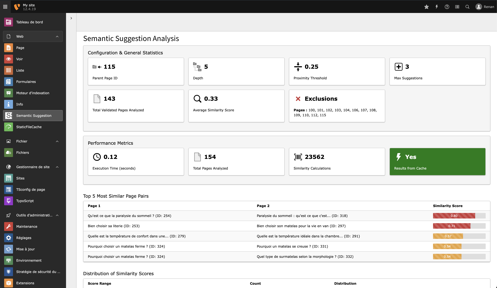

# TYPO3 Extension: Semantic Suggestion

[](https://get.typo3.org/version/12)
[](https://get.typo3.org/version/13)
[](https://packagist.org/packages/talan-hdf/semantic-suggestion)
[](https://packagist.org/packages/talan-hdf/semantic-suggestion)

## Table of Contents

1. [Introduction](#introduction)
2. [Features](#features)
3. [Requirements](#requirements)
4. [Installation](#installation)
5. [Configuration](#configuration)
6. [Usage](#usage)
7. [Backend Module](#backend-module)
8. [Similarity Logic](#similarity-logic)
9. [Display Customization](#display-customization)
10. [Multilingual Support](#multilingual-support)
11. [Debugging and Maintenance](#debugging-and-maintenance)
12. [Security](#security)
13. [Performance](#performance)
14. [File Structure and Logic](#file-structure-and-logic)
15. [Unit Tests](#unit-tests)
16. [Contributing](#contributing)
17. [License](#license)
18. [Support](#support)

## Introduction

The Semantic Suggestion extension for TYPO3 v12 revolutionizes content discovery on your website. By analyzing page content and creating intelligent connections, it offers visitors truly relevant related pages, enhancing navigation and user engagement.


## Features

- 🧠 Intelligent analysis of subpages from a specified parent page
- 📊 Display of title, associated media, and enhanced text excerpt for suggested pages
- ⚙️ Highly configurable via TypoScript
- 🔍 Customizable parent page ID, proximity threshold, and search depth
- 🚀 Optimized performance with database storage of proximity scores
- 🌐 Built-in multilingual support
- 🧩 Improved compatibility with various TYPO3 content structures, including Bootstrap Package
- 🚫 Option to exclude specific pages from analysis and suggestions

## Requirements

- TYPO3 12.0.0-13.9.99
- PHP 8.0 or higher

## Installation

### Composer Installation (recommended)

```bash
composer require talan-hdf/semantic-suggestion
```

### Manual Installation

1. Download the extension from the [TYPO3 Extension Repository (TER)](https://extensions.typo3.org/) or the GitHub repository.
2. Upload the extension file to your TYPO3 installation's `typo3conf/ext/` directory.
3. Activate the "Semantic Suggestion" extension in the TYPO3 Extension Manager.

## Configuration

Customize the extension behavior through TypoScript setup:

```typoscript
plugin.tx_semanticsuggestion {
    settings {
        parentPageId = 1
        proximityThreshold = 0.7
        maxSuggestions = 3
        excerptLength = 150
        recursive = 1
        excludePages = 8,9,3456
        recencyWeight = 0.2

        analyzedFields {
            title = 1.5
            description = 1.0
            keywords = 2.0
            abstract = 1.2
            content = 1.0
        }
    }
}
```

### Weight System for Analyzed Fields

The `analyzedFields` section allows fine-tuning of content field importance:

- Weights can be any positive number
- 1.0 is standard importance
- > 1.0 increases importance
- < 1.0 decreases importance

Example ranges:
- 0.5: Half standard importance
- 1.0: Standard importance
- 1.5: 50% more important than standard
- 2.0: Twice as important as standard
- 3.0+: Significantly more important than standard

### Configuration Parameters

| Parameter | Description |
|-----------|-------------|
| `parentPageId` | Starting point for analysis |
| `proximityThreshold` | Minimum similarity for suggestions (0.0 to 1.0) |
| `maxSuggestions` | Maximum number of suggestions to display |
| `excerptLength` | Maximum length of text excerpts |
| `recursive` | Search depth in page tree (0 = direct children only) |
| `excludePages` | Comma-separated list of page UIDs to exclude |
| `recencyWeight` | Weight of recency in similarity calculation (0-1) |

#### Recency Weight Explained

The `recencyWeight` parameter balances content similarity with publication date:

- 0: Recency has no impact
- 1: Recency has maximum impact

Formula:
```
finalSimilarity = (contentSimilarity * (1 - recencyWeight)) + (recencyBoost * recencyWeight)
```

Choose values based on your content strategy:
- Low (0.1-0.3): Slight favor to recent content
- Medium (0.4-0.6): Balance between similarity and recency
- High (0.7-0.9): Strong favor to recent content

## Usage

### As a Plugin

Insert the "Semantic Suggestions" plugin on desired pages using the TYPO3 backend.

### In Fluid Templates

Use this snippet in your Fluid template:

```html
<f:cObject typescriptObjectPath="lib.semantic_suggestion" />
```

### Custom ViewHelper Integration

1. Declare the namespace:
   ```html
   {namespace semanticSuggestion=TalanHdf\SemanticSuggestion\ViewHelpers}
   ```

2. Use the ViewHelper:
   ```html
   <semanticSuggestion:suggestions 
       pageUid="{data.uid}" 
       parentPageId="1" 
       proximityThreshold="0.3" 
       maxSuggestions="5" 
       depth="1">
       <!-- Custom rendering here -->
   </semanticSuggestion:suggestions>
   ```

Example custom rendering:
```html
<semanticSuggestion:suggestions pageUid="{data.uid}" parentPageId="1" proximityThreshold="0.3" maxSuggestions="5" depth="1">
    <f:if condition="{suggestions}">
        <f:then>
            <ul>
                <f:for each="{suggestions}" as="suggestion">
                    <li>
                        <f:link.page pageUid="{suggestion.data.uid}">
                            {suggestion.data.title}
                        </f:link.page>
                        <p>Similarity: {suggestion.similarity -> f:format.number(decimals: 2)}</p>
                    </li>
                </f:for>
            </ul>
        </f:then>
        <f:else>
            <p>No related pages found.</p>
        </f:else>
    </f:if>
</semanticSuggestion:suggestions>
```

## Backend Module



The backend module provides comprehensive insights:

- Similarity Analysis
- Top Similar Pairs
- Distribution of Similarity Scores
- Configurable Analysis Parameters
- Visual Representations
- Detailed Statistics

Access it under the Web menu in the TYPO3 backend.

### Performance Metrics


The backend module provides crucial performance metrics:

1. **Execution Time (seconds)**
   - Total time for semantic analysis
   - Lower is faster

2. **Total Pages Analyzed**
   - Number of pages included in analysis

3. **Similarity Calculations**
   - Total page-to-page comparisons
   - Calculated as `n * (n-1) / 2`

4. **Results from Cache**
   - Indicates if results were cached
   - "Yes" means faster execution

Use these metrics to optimize extension performance for your specific use case.

## Similarity Logic

1. **Data Gathering**: Collects title, description, keywords, and content for each subpage.
2. **Similarity Calculation**: Compares page pairs using word intersection and union.
3. **Proximity Threshold**: Filters related pages based on configured threshold.
4. **Caching Scores**: Stores calculated scores in `tx_semanticsuggestion_scores` for optimization.

## Display Customization

Customize the Fluid template (List.html) by configuring template paths in TypoScript:

```typoscript
plugin.tx_semanticsuggestion {
    view {
        templateRootPaths.10 = EXT:your_extension/Resources/Private/Templates/
    }
}
```

## Multilingual Support

The extension fully supports TYPO3's multilingual structure, analyzing and suggesting pages in the current site language.

## Debugging and Maintenance

Utilize TYPO3's logging system for detailed information about the analysis and suggestion process.

## Security

- 🛡️ SQL injection protection via TYPO3's QueryBuilder
- 🔒 XSS attack prevention with Fluid template output escaping
- 🔐 Access control for users with appropriate permissions

## Performance

- 💾 Database storage of similarity scores
- 🔄 Periodic score updates
- 🚀 Optimized content retrieval
- 🚫 Efficient handling of excluded pages
- 📊 Improved caching mechanisms
- 🔢 Batch processing for server load management

## File Structure and Logic

```
semantic_suggestion/
├── Classes/
│   ├── Controller/
│   │   ├── SemanticBackendController.php
│   │   └── SuggestionsController.php
│   └── Service/
│       └── PageAnalysisService.php
├── Configuration/
│   ├── Backend/
│   │   ├── Modules.php
│   │   └── Routes.php
│   ├── TCA/
│   │   └── Overrides/
│   │       ├── sys_template.php
│   │       └── tt_content.php
│   ├── TypoScript/
│   │   ├── constants.typoscript
│   │   └── setup.typoscript
│   └── Services.yaml
├── Documentation/
│   ├── Index.rst
│   ├── Installation/
│   │   └── Index.rst
│   ├── Introduction/
│   │   └── Index.rst
│   └── Medias/
│       ├── backend_module.png
│       ├── backend_module_performance_metrics.jpg
│       └── frontend_on_the_same_theme_view.jpg
├── Resources/
│   ├── Private/
│   │   ├── Language/
│   │   │   ├── locallang.xlf
│   │   │   ├── locallang_be.xlf
│   │   │   ├── locallang_mod.xlf
│   │   │   └── locallang_semanticproximity.xlf
│   │   ├── Layouts/
│   │   │   └── Default.html
│   │   └── Templates/
│   │       ├── SemanticBackend/
│   │       │   ├── Index.html
│   │       │   └── List.html
│   │       └── Suggestions/
│   │           └── List.html
│   └── Public/
│       ├── Css/
│       │   └── SemanticSuggestion.css
│       └── Icons/
│           ├── Extension.svg
│           ├── module-semantic-suggestion.svg
│           └── user_mod_semanticproximity.svg
├── Tests/
│   ├── Fixtures/
│   │   └── pages.xml
│   ├── Integration/
│   │   └── Service/
│   │       └── PageAnalysisServiceIntegrationTest.php
│   └── Unit/
│       └── Service/
│           └── PageAnalysisServiceTest.php
├── .env
├── .gitignore
├── CHANGELOG.md
├── IMPROVEMENTS.MD
├── LICENSE
├── README.md
├── ROADMAP_TO_STABLE.md
├── composer.json
├── ext_conf_template.txt
├── ext_emconf.php
├── ext_localconf.php
├── ext_tables.php
└── phpunit.xml.dist
```

## Unit Tests

Our comprehensive test suite ensures reliability and correctness:

### Test Coverage

1. Page Data Preparation
2. Page Analysis
3. Similarity Calculation
4. Common Keywords Detection
5. Relevance Determination
6. Performance Testing
7. Cache Handling
8. Edge Case Handling
9. Content Size Limits

### Running Tests

Execute tests using DDEV:

```bash
ddev exec vendor/bin/phpunit -c packages/semantic_suggestion/phpunit.xml.dist --testdox --colors=always
```

For specific tests:

```bash
ddev exec vendor/bin/phpunit -c packages/semantic_suggestion/phpunit.xml.dist --filter testMethodName
```

### Interpreting Results

- ✔ Green: Passed tests
- ✘ Red: Failed tests
- ⚠ Yellow: Risky or incomplete tests

Regular test execution is recommended to ensure functionality and catch regressions.

## Contributing

We welcome contributions! Here's how:

1. Fork the repository
2. Create a new branch for your feature/fix
3. Make changes and commit with clear messages
4. Push changes to your fork
5. Submit a pull request to the main repository

Please follow existing coding standards and include appropriate tests.

## License

This project is licensed under the GNU General Public License v2.0 or later. See the [LICENSE](LICENSE) file for details.

## Support

For support and further information, contact:

Wolfangel Cyril  
Email: cyril.wolfangel@gmail.com

For bug reports and feature requests, use the [GitHub issue tracker](https://github.com/your-username/semantic-suggestion/issues).

For additional documentation and updates, visit our [GitHub repository](https://github.com/your-username/semantic-suggestion).